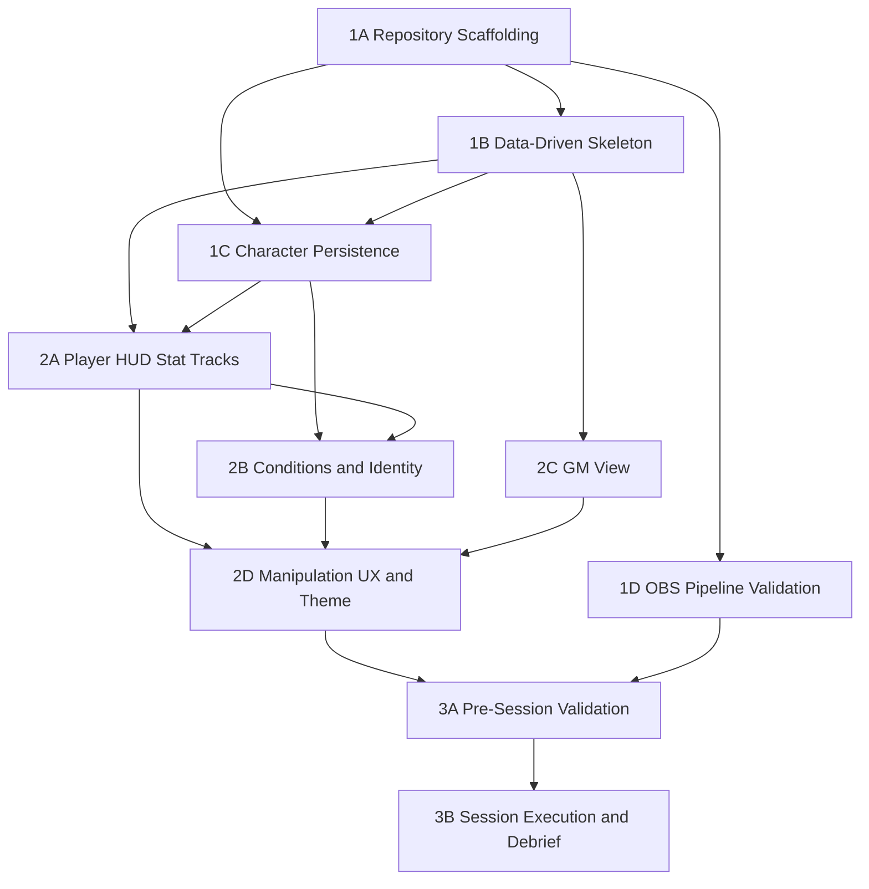

# Vellum Architecture

## 1. Introduction and Goals

### 1.1 Requirements Overview

Vellum is a local-only, TTRPG-system-aware camera overlay. A web app renders a character HUD composited onto the player's webcam feed via OBS browser source plus OBS Virtual Camera, which Discord receives as the player's camera input. MVP ships the Daggerheart frame (Player HUD + GM Fear view). The system is built data-driven from day one so adding a future system frame is config + components, not a rewrite.

**Target Release:** MVP — owner's group runs one complete Daggerheart session using Vellum with no fallback to Demiplane.

| REQ-ID | Requirement | Priority |
|--------|-------------|----------|
| REQ-001 | Hope pip display (max 6) | Must |
| REQ-002 | Hope one-click manipulation | Must |
| REQ-003 | HP track display (class-variable 5–12) | Must |
| REQ-004 | HP slot manipulation | Must |
| REQ-005 | HP Major/Severe threshold indicators | Should |
| REQ-006 | Stress track display (default 6, max 12) | Must |
| REQ-007 | Stress slot manipulation | Must |
| REQ-008 | Armor slots display (0/3/4 by armor type) | Must |
| REQ-009 | Armor slot manipulation | Must |
| REQ-010 | Core condition badges (Hidden/Restrained/Vulnerable) | Must |
| REQ-011 | Core condition toggle | Must |
| REQ-012 | Feature condition badges (extensible) | Should |
| REQ-013 | Character identity label (Name + Class + Ancestry) | Must |
| REQ-014 | Optional identity fields (Subclass/Community/Level) | Could |
| REQ-015 | Fear pip display (max 12) | Must |
| REQ-016 | Fear one-click manipulation | Must |
| REQ-017 | Distinct GM view mode | Must |
| REQ-018 | System config as data | Must |
| REQ-019 | Theme config as data | Must |
| REQ-020 | Generic stat-track component abstraction | Must |
| REQ-021 | localStorage session persistence | Must |
| REQ-022 | JSON character import | Must |
| REQ-023 | JSON character export | Must |
| REQ-024 | In-session manipulation without alt-tab | Must |
| REQ-025 | Hope/Fear single-click cost | Must |
| REQ-026 | Conditions toggle panel acceptable | Could |
| REQ-027 | 1920×1080 canvas | Must |
| REQ-028 | 640×360 effective legibility | Must |
| REQ-029 | Thumbnail (~200–300px) scannability | Should |
| REQ-030 | Local-only operation (no network) | Must |
| REQ-031 | Refresh resilience (<1s restore) | Must |
| REQ-032 | Render performance under OBS | Must |
| REQ-033 | TypeScript source | Must |
| REQ-034 | Modern Chromium target | Must |
| REQ-035 | Daggerheart aesthetic alignment | Should |
| REQ-036 | Per-instance state isolation | Must |
| REQ-037 | OBS setup documentation | Should |
| REQ-038 | OBS browser source rendering target | Must |
| REQ-039 | OBS Virtual Camera scene compatibility | Must |
| REQ-040 | Discord webcam input format compliance | Must |
| REQ-041 | File-system character JSON I/O | Must |
| REQ-042 | No external API integrations | Must |

### 1.2 Quality Goals

| Priority | Quality Goal | Motivation |
|----------|-------------|------------|
| 1 | In-session responsiveness — stat manipulation updates within one render frame, no modal | Hope and Fear change on nearly every roll; any perceptible lag reintroduces the alt-tab pain the product exists to eliminate |
| 2 | Refresh resilience — all stat values restored from localStorage within 1 second perceived after any page reload | OBS browser source reloads happen accidentally; losing state mid-session is a session-ending incident |
| 3 | Legibility at Discord call scale — critical values and identity label readable at 640×360 tile, primary stats parseable at 200–300px thumbnail | The overlay is only useful if other participants can actually read it in a real multi-person call |

### 1.3 Stakeholders

| Role | Name / Team | Expectations |
|------|------------|--------------|
| Owner / Engineer / PM | alxjrvs | Ships a working session tool for their gaming group; makes all architecture and prioritization decisions |
| Player (3–5 group members) | Owner's gaming group | Can update Hope/HP/Stress/Armor/conditions during live play without alt-tabbing; sees HUD in Discord call |
| GM (owner or one group member) | Owner's gaming group | Tracks Fear pool on their own camera; reads player state from their HUD tiles in the call |
| External: OBS validation buddy | One group member with OBS installed | Confirms OBS pipeline works on their machine during M1 |
| External: Theme reviewer | One group member with aesthetic taste | Informal feedback on Daggerheart theme before Gate 2 group review |

---

## 2. Architecture Constraints

| Type | Constraint | Rationale |
|------|-----------|-----------|
| Technical | TypeScript throughout — all source files `.ts` / `.tsx`, strict mode, no `any` in production paths (REQ-033) | Owner preference; strict typing is prerequisite for the discriminated-union system/theme config design |
| Technical | No network calls after initial load — no CDN assets, no external APIs, no telemetry, no auth (REQ-030, REQ-042) | Local-only design principle; the app must function offline during a session |
| Technical | OBS Chromium Embedded Framework target only — no Firefox/Safari polyfills (REQ-034, REQ-053) | OBS browser source uses CEF (Chromium 103+); cross-browser support adds overhead with no deployment benefit |
| Technical | 1920×1080 canvas with CSS `background: transparent` for OBS alpha compositing (REQ-027, REQ-038) | OBS composites the browser source over the webcam; transparency is achieved via CSS, not chroma key |
| Technical | All assets bundled at build time — no runtime CDN fonts, no external image URLs (REQ-030) | Ensures offline operation; any library that phones home is rejected |
| Technical | localStorage for session persistence — synchronous reads on mount (REQ-021, REQ-031) | Achieves <1 s restore target; available in OBS CEF under both localhost and file:// origins |
| Technical | Browser-native File API for character I/O — no filesystem server, no Electron (REQ-041) | Local-only constraint; browser File API is available in CEF without native packaging |
| Organizational | No backend, no accounts, no sync — each player's instance is fully self-contained (REQ-043, REQ-044) | Group is small, fixed, and trusted; sync complexity is not justified for the MVP success criterion |
| Organizational | No public-release packaging or installer (REQ-047) | Group runs from source or pre-built dist/; no code signing or distribution infrastructure |
| Organizational | Daggerheart SRD baseline: September 9, 2025 (Daggerheart-SRD-9-09-25.pdf) | Canonical rules snapshot for stat values; errata of same date |
| Convention | Bun as package manager and script runner | Owner preference; Bun install speed and compatibility with Vite confirmed |
| Convention | Vite `base: './'` in config | Ensures relative asset paths work under `file://` scheme for session-mode serving |

---

## 3. System Scope and Context

### 3.1 Business Context

Vellum sits between the player at their desk and the Discord video call. Each player/GM runs their own fully independent instance. There is no shared backend.

| Actor | Input | Output | Description |
|-------|-------|--------|-------------|
| Player (alxjrvs + 3–5 group members) | Click/keypress on stat elements; character JSON file from disk | Updated HUD rendered on their webcam via OBS Virtual Camera → Discord | Manipulates Hope, HP, Stress, Armor, conditions without alt-tabbing |
| GM (owner or group member) | Click/keypress on Fear pip; GM character JSON from disk | Fear pip track rendered on their webcam via OBS Virtual Camera → Discord | Tracks Fear pool during play; reads player states from their camera HUDs in the call |
| OBS (external tool) | Vellum browser source URL (localhost or file://); webcam capture source | Composited 1920×1080 scene output → Virtual Camera device | Composites the Vellum HUD over the webcam; presents result as a virtual webcam to Discord |
| Discord (external platform) | OBS Virtual Camera as webcam input | Player's video tile in the call (downscaled ~640×360 effective) | Displays the composited HUD-on-webcam feed to all call participants |
| Filesystem (local disk) | Character JSON export from Vellum | Character JSON import into Vellum | Portable character file for cross-session state and between-session advancement edits |

### 3.2 Technical Context

| Channel / Interface | Protocol | Direction | Description |
|--------------------|----------|-----------|-------------|
| OBS browser source → Vellum | HTTP (localhost dev) or file:// (session build) | OBS reads from Vellum | OBS CEF loads Vellum at 1920×1080 with Allow Transparency; renders via Chromium |
| Vellum → localStorage | Browser Storage API (synchronous) | Read on mount; write on every state change | Session state persistence; scoped to browser origin |
| User → Vellum | Mouse click / keypress | Inbound UI events | Stat manipulation; panel open/close; file picker activation |
| Filesystem → Vellum | Browser File API (`<input type="file">`) | Read on import | Character JSON loaded from local disk into active character state |
| Vellum → Filesystem | Browser File API (`Blob` + `URL.createObjectURL`) | Write on export | Character JSON downloaded to local disk |
| OBS scene output → OBS Virtual Camera | OS virtual camera driver | OBS → OS | Exposes the composed scene as a virtual webcam device |
| OBS Virtual Camera → Discord | OS webcam device protocol | OS → Discord | Discord receives the composed feed as the participant's camera input |

All channels are local. There are no network sockets, no WebSocket connections, no HTTP requests to external hosts after initial load.

---

## 4. Solution Strategy

| Goal | Approach | Technology / Pattern |
|------|---------|---------------------|
| Render TTRPG stat HUD composited onto webcam feed visible in Discord | Static locally-served web app consumed as OBS browser source; OBS composites browser source over webcam; OBS Virtual Camera exposes result to Discord | React 19 + Vite dev server (local) / static file serve (session) |
| Zero network calls after initial load; fully local | All assets bundled at build time; no CDN assets, no telemetry, no runtime fetch calls | Vite production build (all assets inlined/bundled); no runtime fetch |
| TypeScript throughout with strict mode (REQ-033) | All source `.ts` / `.tsx`; strict config; discriminated unions for system/theme config shapes | TypeScript 6.x, strict config |
| Data-driven stat model so second system frame is config + reuse, not a rewrite (REQ-018, REQ-019, REQ-020) | System config and theme config are TypeScript data files loaded at runtime; generic `StatTrack` component family renders any pip/slot track from config inputs | Discriminated-union TS types for configs; React component props derived from config shape |
| Session state survives OBS browser source reload in <1 s (REQ-031) | Write all mutable stat state to `localStorage` on every change; read synchronously on mount | Browser `localStorage` API (synchronous, zero-latency reads) |
| Portable character files across sessions (REQ-022, REQ-023, REQ-041) | JSON import via browser `<input type="file">` File API; JSON export via `Blob` + `URL.createObjectURL` | Browser-native File API; no filesystem server |
| Per-player state isolation (REQ-036) | Each instance is a separate browser context with its own `localStorage` scope; no shared state mechanism | Architecture constraint — separate machines, separate origins |
| One-click Hope/Fear manipulation (REQ-025) | Direct click handlers on pip elements; no modal; state update + localStorage write in one synchronous step | React event handlers; no async in the hot manipulation flow |
| Agentic development leverage | Engineer directs AI agents for code generation, test writing, and boilerplate; focuses personal attention on architecture decisions, OBS pipeline validation, and quality review | Claude Code (Heavy leverage on scaffold and component work; Moderate on platform integration; Minimal on manual validation) |

---

## 5. Building Block View

### 5.1 Level 1 — System Overview

#### Unit: 1A — Repository Scaffolding

**Purpose:** Establish the project foundation — directory structure, TypeScript config, build tooling, dev tooling, and test infrastructure. All subsequent units depend on this being stable.

**Responsibilities:**
- Initialize a single-app TypeScript + React project with Bun as package manager
- Configure Vite 6 with `@vitejs/plugin-react` and `base: './'` for file:// compatibility
- Configure ESLint, Prettier, and tsc strict mode; wire pre-commit lint + type-check hooks
- Set up Vitest with jsdom environment and coverage reporting
- Produce at least one passing smoke test

**Deliverables:**
- Project compiles and boots locally (`bun run dev` serves at localhost:5173)
- All checks pass on clean repo (`bun run check` exits 0)
- `bun run test` runs and reports coverage; at least one passing test

**Dependencies:**
- None — first unit

---

#### Unit: 1B — Data-Driven Architecture Skeleton

**Purpose:** Define the TypeScript types for system config and theme config, populate the Daggerheart system config with correct SRD values, and implement the generic `StatTrack` component family. This is the architectural backbone that all HUD components build on.

**Responsibilities:**
- Define TypeScript discriminated-union types for `SystemConfig` (stat definitions, defaults, condition list, manipulation rules)
- Define TypeScript types for `ThemeConfig` (color tokens, typography scale, layout tokens, frame artwork asset references)
- Populate `daggerheart.system.ts` with SRD-correct values (Hope=6, Fear=12, HP class table, Stress=6, armor table, core + feature condition list)
- Populate `daggerheart.theme.ts` skeleton with Daggerheart visual tokens
- Implement `StatTrack` generic component family that renders any pip/slot track from config inputs
- Expose system and theme configs via React context

**Deliverables:**
- Config files validate against their TypeScript types; no values hardcoded in component source
- `StatTrack` renders Hope, HP, Stress, Fear, Armor from one component family driven by config
- Adding a new track requires zero new component code

**Dependencies:**
- 1A (project scaffold must exist)

---

#### Unit: 1C — Character Persistence Layer

**Purpose:** Implement the full persistence contract: localStorage session state (auto-save and restore), JSON character import from disk, and JSON character export to download.

**Responsibilities:**
- Implement `localStorage` read/write for active character state (Hope, HP slots, Stress slots, Armor slots, conditions, identity) on every state change
- Implement JSON character import via browser `<input type="file">` File API with schema validation and clear error on invalid input
- Implement JSON character export via `Blob` + `URL.createObjectURL` browser download
- Document and enforce the character JSON schema (see ADR-003 for field definitions)

**Deliverables:**
- Page reload within <1 second restores all current values (localStorage path)
- Selecting a valid character JSON loads all fields; invalid/missing fields show a clear error, not a crash
- Export produces a valid JSON file; re-importing the exported file produces identical state

**Dependencies:**
- 1A (project scaffold)
- 1B (character schema shape is defined by system config types)

---

#### Unit: 1D — OBS Pipeline Validation

**Purpose:** Confirm the OBS browser source → OBS Virtual Camera → Discord webcam delivery path works end-to-end on the group's actual machines before the feature build begins. This is a load-bearing gate: a broken pipeline discovered late in M2 is a session-ending risk.

**Responsibilities:**
- Serve the Vellum app at `localhost:5173` (dev) and validate it loads as an OBS browser source at 1920×1080 with transparency
- Validate that CSS `background: transparent` + OBS "Allow Transparency" achieves alpha-channel compositing over a webcam source
- Validate OBS Virtual Camera → Discord receives a 16:9 composited feed without format rejection
- Verify OBS CEF Chromium version is 103+ on each group member's machine

**Deliverables:**
- OBS renders app without blank page or CORS errors; transparency is intact when composited over webcam scene
- Discord receives a 16:9 webcam feed with the Vellum layer composited; no format rejection
- Documented manual smoke-test procedure: [docs/obs-pipeline-verification.md](obs-pipeline-verification.md)

**Dependencies:**
- 1A (app must boot and serve)

---

#### Unit: 2A — Player HUD Stat Tracks

**Purpose:** Implement all five interactive stat tracks on the Player HUD — Hope, HP, Stress, Armor, and HP threshold indicators. These are the highest-frequency interaction elements.

**Responsibilities:**
- Hope pip track: 6-pip, filled/empty state, +1/−1 manipulation, max 6 enforced
- HP slot track: class-variable slot count (5–12) from character config; mark/unmark slots; slot count matches character JSON class field
- HP threshold indicators (Should-Have): Major and Severe thresholds marked on HP track using formula `armor base + level` (or `level` / `level×2` unarmored); visual markers only, no automatic damage resolution
- Stress slot track: default 6 slots (max 12 via advancement from character config); mark/unmark
- Armor slot track: 0/3/4 slots from equipped armor type in character config; mark/unmark; zero slots shown for unarmored

**Deliverables:**
- Each stat track renders from system config and character JSON; no hardcoded values
- Single click increments/decrements or marks/unmarks; visual update within one render frame
- All stat values persist through page reload (localStorage round-trip)

**Dependencies:**
- 1B (StatTrack component family and system config)
- 1C (localStorage persistence layer for state writes)

---

#### Unit: 2B — Player HUD Conditions and Identity

**Purpose:** Implement condition badge rendering and toggling (core + feature conditions) and the character identity label. Co-located with 2A on the Player HUD.

**Responsibilities:**
- Core condition badges: Hidden, Restrained, Vulnerable — rendered with active/inactive visual state; toggle on one click; state persists to localStorage
- Feature condition badge list: configurable badge list from character config (~13 supported names); badges render alongside core badges; toggling updates state and localStorage
- Conditions panel UX: panel that exposes all condition badges (acceptable to require one open step); panel opens with one click; all badges visible and toggleable inside
- Character identity label: compact label rendering Name — Class, Ancestry from character JSON fields; no hardcoded placeholder text
- Optional identity fields: Subclass, Community, Level shown if present in character config; absent fields render gracefully (no empty placeholders)

**Deliverables:**
- All condition badges toggle correctly; state persists
- Identity label renders from character JSON
- Conditions panel opens/closes in one click; all badges accessible inside

**Dependencies:**
- 1B (system config for condition list schema)
- 1C (localStorage writes for condition state)
- 2A (co-located on Player HUD; HUD layout must exist)

---

#### Unit: 2C — GM View

**Purpose:** Implement the distinct GM rendering mode — Fear pip track only, minimal frame, no player stats. The GM uses this to track their Fear pool on camera.

**Responsibilities:**
- GM rendering mode activated by URL query parameter `?mode=gm` (or config flag); no player-stat elements in DOM in GM mode
- Fear pip track: 12-pip (max per SRD), +1/−1 manipulation, one click/keypress, max 12 enforced, updates within one frame
- GM minimal frame: visual frame using Daggerheart theme; legible at Discord call resolution
- CharacterContext handles GM mode state correctly (Fear value + optional identity; no player stat fields required)

**Deliverables:**
- URL parameter activates GM mode; no player-stat elements rendered
- Fear pip track increments/decrements correctly; max enforced
- GM character JSON (Fear initial value + identity) imports without error

**Dependencies:**
- 1B (StatTrack component for Fear pip; system config for Fear=12)

---

#### Unit: 2D — Manipulation UX and Daggerheart Theme

**Purpose:** Integrate the control-surface architecture across all HUD elements, apply the Daggerheart visual theme, and validate legibility at Discord call scale.

**Responsibilities:**
- Control-surface implementation (ADR-005 click-on-HUD model): all interactive stat elements on the 1920×1080 canvas; CSS `cursor: none` on canvas background to reduce cursor-on-face effect
- Daggerheart visual theme: colors, typography, frame artwork, layout tokens applied to both Player and GM views; parchment / card / gold-black register
- Discord-scale legibility pass: render review at 640×360 effective and ~200–300px thumbnail; all critical values and identity label legible; typography and pip size validated at actual Discord tile scale
- Group review: owner + at least one group member reviews HUD on a real Discord call

**Deliverables:**
- No stat update requires leaving Vellum; Hope/Fear = zero modal; all stats reachable in one UI context
- Owner + group confirm theme feels Daggerheart-native in a real Discord call context
- All critical values legible at 640×360; identity label + Hope pip count readable at thumbnail

**Dependencies:**
- 2A (all Player HUD stat tracks must exist)
- 2B (conditions + identity must exist)
- 2C (GM view must exist for full legibility pass)

---

#### Unit: 3A — Pre-Session Validation

**Purpose:** Prepare every group member for the live session — character JSON files ready, OBS pipelines working on each machine, setup documentation available and tested.

**Responsibilities:**
- Prepare valid Vellum character JSON for each player (class-correct HP, Stress cap, armor type, condition list, identity fields)
- Each player and GM: loads character, configures OBS browser source at 1920×1080, enables Virtual Camera, selects as Discord input — confirmed working
- OBS setup documentation: step-by-step guide for non-OBS-expert group members; tested by at least one group member independently

**Deliverables:**
- All character JSONs import without error; each player's HUD renders correct values on load
- Every participant reaches a working HUD-on-Discord state; no show-stoppers
- A group member unfamiliar with OBS follows the guide and reaches working state with ≤1 round of clarification

**Dependencies:**
- All M1 and M2 units (full feature set must be Gate 2-accepted before pre-session validation begins)

---

#### Unit: 3B — Session Execution and Debrief

**Purpose:** Run the live Daggerheart session using Vellum as the stat-tracking tool and capture the outcome metrics that determine project success.

**Responsibilities:**
- Whole group plays one complete Daggerheart session with Vellum for Hope, HP, Stress, Fear, Armor, and core conditions; zero mid-session fallback to Demiplane
- Owner collects OM-1 through OM-5 qualitative data from group (alt-tab reduction, GM visibility, theme acceptance, incident count)
- Post-MVP backlog capture: any gaps surfaced during the session logged for future iteration

**Deliverables:**
- OM-1: session completes with no mid-session fallback; zero session-ending incidents
- All five outcome metrics recorded; go/no-go verdict documented
- Post-session backlog items documented

**Dependencies:**
- 3A (all group members must be rehearsed and pipeline-validated)

---

### 5.2 Level 2 — Unit Internals (complex units only)

#### Unit: 1B — Data-Driven Architecture Skeleton

##### Subcomponent: SystemConfig Type + Daggerheart Instance

**Purpose:** Define the TypeScript contract for all TTRPG stat models; provide the Daggerheart-specific values.

**Interfaces:** Consumed by `CharacterContext` at initialization; shapes the props accepted by `StatTrack` component instances.

**Key decisions:** Discriminated-union type on `system` field enables TypeScript to narrow to system-specific stat definitions without `any` casts. All Daggerheart values (Hope=6, Fear=12, HP class table, armor slot counts, condition list) live in `daggerheart.system.ts` — no values hardcoded in component source.

##### Subcomponent: ThemeConfig Type + Daggerheart Instance

**Purpose:** Define the visual identity contract; inject tokens as CSS custom properties at app mount.

**Interfaces:** Consumed at app root; injects `var(--token-name)` CSS variables onto `:root`; all component stylesheets reference tokens only.

**Key decisions:** Theme tokens are a TypeScript data file, not CSS variables defined manually — this is what "theme-as-data" means at the implementation layer. No CSS-in-JS library.

##### Subcomponent: StatTrack Component Family

**Purpose:** Generic pip/slot renderer that renders any resource track from config inputs.

**Interfaces:** Props: `{ trackLength: number; currentValue: number; label: string; onIncrement: () => void; onDecrement?: () => void; markedSlots?: boolean[]; onToggleSlot?: (index: number) => void }`. Instances: Hope (pip, +/−), HP (slots, mark/unmark), Stress (slots), Armor (slots), Fear (pip, +/−).

**Key decisions:** Single component family eliminates per-stat components. Adding a new track type (e.g., a future system's "Momentum") requires zero new component code — only a new config entry and a `StatTrack` instance in the layout.

#### Unit: 2D — Manipulation UX and Daggerheart Theme

##### Subcomponent: Control Surface (Click-on-HUD)

**Purpose:** Wire all interactive stat elements on the 1920×1080 canvas as direct click targets.

**Interfaces:** Stat element click handlers dispatch to `CharacterContext` reducer; no intermediate controller layer.

**Key decisions:** ADR-005 — click-on-HUD shipped first; `cursor: none` on canvas background minimizes cursor visibility on composited output. Split-layout upgrade path documented for Gate 2 contingency.

##### Subcomponent: Daggerheart Theme Application

**Purpose:** Apply visual tokens to all HUD elements; achieve Daggerheart aesthetic alignment (REQ-035).

**Interfaces:** ThemeConfig tokens injected at `:root`; all component CSS uses `var(--token-name)` references.

**Key decisions:** CSS Modules for component-scoped styles; global tokens sheet for `:root` injection. No Tailwind, no CSS-in-JS — neither provides meaningful benefit for a single-component-family app.

---

### 5.3 Build Order

| Order | Unit | Rationale |
|-------|------|-----------|
| 1 | 1A — Repository Scaffolding | Foundation; all other units require the project to compile and boot |
| 2 | 1B — Data-Driven Architecture Skeleton | Type system and StatTrack component must exist before any HUD work; 1C needs the schema shape |
| 3 | 1C — Character Persistence Layer | Persistence must exist before HUD components can write state; import/export needed for all downstream testing |
| 4 | 1D — OBS Pipeline Validation | Parallel to 1B/1C in theory; run after 1A is stable; must pass Gate 1 before M2 begins |
| 5 | 2A — Player HUD Stat Tracks | Core HUD; must exist before 2B (co-located) and 2D (legibility pass) |
| 6 | 2B — Player HUD Conditions and Identity | Co-located on Player HUD; 2A must exist first |
| 7 | 2C — GM View | Reuses StatTrack from 1B; can be built in parallel with 2A/2B |
| 8 | 2D — Manipulation UX and Daggerheart Theme | All HUD elements (2A, 2B, 2C) must exist for the control surface and legibility pass |
| 9 | 3A — Pre-Session Validation | All M1 + M2 Gate 2-accepted; logistical and documentation work |
| 10 | 3B — Session Execution and Debrief | 3A must be complete; session is the final gate |

### 5.4 Dependency Matrix



---

## 6. Runtime View

### Scenario: Player loads character and HUD renders (US-7, AC-6, AC-1)

Participants: OBS CEF browser, CharacterContext, localStorage, JSON file on disk.

1. OBS loads the browser source URL. The React app mounts.
2. On mount, `CharacterContext` reads `localStorage` key `vellum:character`. If present, it deserializes and sets as the initial state — this is the <1 s refresh restore path (REQ-031).
3. If `localStorage` is empty (first load), the HUD renders with a placeholder state showing an import prompt.
4. The player uses the file picker (`<input type="file">`) to select their character JSON. The File API reads the file; the character schema validator checks the payload; `CharacterContext` dispatch sets the new character state.
5. On every dispatch, a `useEffect` writes the full character state back to `localStorage`.
6. The `StatTrack` component instances (Hope, HP, Stress, Armor, conditions) re-render from the new state. The HUD is live.

Critical path: steps 2 and 5 are synchronous localStorage operations — no async, no latency cliff.

---

### Scenario: Player gains Hope (US-1, AC-2, REQ-002, REQ-025)

Participants: Player (click), StatTrack Hope instance, CharacterContext, localStorage.

1. Player clicks the next unfilled Hope pip on the HUD.
2. The pip's `onClick` handler dispatches `{ type: 'HOPE_INCREMENT' }` to `CharacterContext`'s reducer.
3. Reducer increments `state.stats.hope` by 1, clamp to max 6. Returns new state.
4. `useEffect` fires synchronously after render: writes updated character state to `localStorage`.
5. The Hope `StatTrack` re-renders the pip at the new fill level. One render frame elapsed.

No modal, no async, no network. Total latency: one synchronous React state update cycle.

---

### Scenario: Player marks an HP slot on incoming damage (US-2, AC-2, REQ-004)

Same pattern as Hope gain with action `{ type: 'HP_MARK_SLOT', payload: { index: N } }`. The reducer marks the Nth slot in the HP slot array. The HP `StatTrack` re-renders slot states. localStorage write follows. One render frame.

---

### Scenario: Player toggles a condition badge (US-5, AC-5, REQ-011)

1. Player opens the conditions panel (one click on the panel toggle button).
2. The panel reveals all condition badges (3 core + feature list from character config).
3. Player clicks a badge (e.g., "Vulnerable"). Dispatch: `{ type: 'CONDITION_TOGGLE', payload: { condition: 'Vulnerable' } }`.
4. Reducer flips the boolean in `state.conditions.core.Vulnerable`. localStorage write follows.
5. The badge re-renders with the new active/inactive state. The panel remains open.

Panel open/close state is local `useState` — not persisted to localStorage (cosmetic UI state, not character state).

---

### Scenario: GM loads GM view and tracks Fear (US-9, AC-3, REQ-016, REQ-017)

1. GM opens the Vellum URL with `?mode=gm` query parameter.
2. The app reads the mode flag; `CharacterContext` determines the active view is GM mode.
3. The HUD renders only the Fear `StatTrack` (max 12) and the minimal GM frame. No player-stat elements are mounted.
4. The GM character JSON (Fear initial value + optional identity) is imported or starts from defaults.
5. GM clicks a Fear pip to increment/decrement. Same dispatch/reducer/localStorage path as Hope gain.

---

### Scenario: Player exports character JSON between sessions (US-8, AC-6, REQ-023)

1. Player clicks "Export Character" button.
2. Handler serializes `CharacterContext` state to JSON string via `JSON.stringify`.
3. Creates a `Blob` with `application/json` MIME type; generates an object URL; triggers a synthetic anchor click with the `download` attribute set to `[name]-vellum.json`.
4. Browser downloads the file. No network request, no server.

---

### Scenario: OBS compositing and Discord delivery (US-10, AC-8, REQ-038–040)

This flow is external to Vellum's code; documented for architecture completeness.

1. OBS scene contains two layers: (a) Webcam capture source, (b) Vellum browser source at 1920×1080 with "Allow Transparency" enabled.
2. Vellum's `<body>` CSS sets `background: transparent`. HUD elements render on a transparent canvas; the player's face shows through non-HUD areas.
3. OBS composites layer (b) over layer (a). The result is a 1920×1080 frame with webcam video and HUD elements merged.
4. OBS Virtual Camera presents this composed scene as a virtual webcam device.
5. Discord's "Select Camera" input is set to the OBS Virtual Camera. Discord receives the composed 1920×1080 feed and displays it as the participant's video tile (~640×360 effective in multi-person calls).

Vellum makes zero network calls during any step.

---

## 7. Deployment View

| Environment | Host / Platform | Notes |
|------------|----------------|-------|
| Development | `bun run dev` → Vite dev server at `localhost:5173` | OBS browser source URL: `http://localhost:5173`; Vite HMR is ignored inside OBS CEF (acceptable) |
| Session (no dev tools) | `bun run build` → `dist/` folder; OBS browser source: `file:///absolute/path/to/dist/index.html` | Vite `base: './'` ensures relative asset paths work under `file://`; shareable by distributing `dist/` folder |
| Degraded (no OBS) | App runs in a plain desktop Chromium browser window | No webcam compositing; stats tracked on-screen in the browser; fallback path per PRD R-2 |

There is no staging environment. There is no production server. There is no CI/CD pipeline deploying to any host. The "deployment" is a local file or local dev server on each player's machine.

### Per-Player Setup

Each player follows the same steps on their own machine:
1. Clone the repo or receive a pre-built `dist/` folder.
2. (If cloning) `bun install && bun run dev`.
3. Open OBS → add Browser Source → URL: `http://localhost:5173` (or `file://` path) → Width: 1920, Height: 1080 → Allow Transparency: enabled.
4. Add Webcam capture source to the same OBS scene; position layers (webcam below, Vellum above).
5. Start OBS Virtual Camera. In Discord Settings → Voice & Video → Camera: select OBS Virtual Camera.
6. Import character JSON in the Vellum UI.

Setup is performed once per machine. OBS scene settings persist; the player reopens OBS at the next session and reloads the character JSON.

---

## 8. Cross-cutting Concepts

### 8.1 Tech Stack

| Layer | Technology | Version / Notes |
|-------|-----------|----------------|
| Language | TypeScript | 6.x, strict mode, no `any` in production paths |
| UI Framework | React | 19; component model drives the `StatTrack` generic family |
| Build Tool | Vite | 6; `@vitejs/plugin-react`; `base: './'` for file:// safety |
| Package Manager | Bun | Latest stable; used for install, script running, and lockfile |
| Test Runner | Vitest | Vite-native; jsdom environment; coverage via v8 |
| Test Utilities | React Testing Library | Component tests as a user would interact (click pip → assert count) |
| CSS Architecture | CSS Modules + CSS custom properties | Component-scoped styles; theme tokens injected as `var(--token-name)` at `:root` |
| Persistence | Browser `localStorage` API | Synchronous; available in OBS CEF under localhost and file:// origins |
| File I/O | Browser File API | `<input type="file">` for import; `Blob` + `URL.createObjectURL` for export |
| Runtime Target | OBS CEF (Chromium Embedded Framework) | Chromium 103+ basis (OBS 29+); also runs in desktop Chromium browsers |

### 8.2 Architectural Patterns

- **Data-driven rendering:** System config and theme config are TypeScript data files loaded at app initialization. No stat-specific values are hardcoded in component source. The generic `StatTrack` component family renders any pip/slot track from config inputs — this is the primary extensibility mechanism for future TTRPG system frames.
- **Reducer pattern for character state:** `useReducer` with explicit action types (`HOPE_INCREMENT`, `HP_MARK_SLOT`, `CONDITION_TOGGLE`, etc.) provides a clear audit trail of state transitions and a single synchronization point for localStorage writes.
- **Context provider at root:** A single `CharacterContext` provider makes all stat values and dispatch available throughout the component tree without prop drilling through the stat-track component family.
- **View-mode routing via URL parameter:** GM vs. Player mode is determined by `?mode=gm` query parameter. No routing library required — a single conditional at the root renders either the Player HUD or the GM view.
- **Synchronous localStorage writes:** Every state mutation writes to `localStorage` synchronously in a `useEffect` after render. Reads on mount are synchronous. This eliminates async complexity in the persistence path and achieves the <1 s restore target.
- **Alpha compositing for OBS integration:** CSS `background: transparent` on `<body>` + OBS "Allow Transparency" checkbox achieves alpha-channel compositing without chroma key. No color spill, no green-screen setup.

### 8.3 Conventions

- All source files `.ts` or `.tsx`; no `.js` files in the src tree
- Vite config: `base: './'` is a hard requirement — never change this without validating file:// serving
- Component file naming: `PascalCase.tsx` for components, `camelCase.ts` for utilities
- CSS Modules: one `.module.css` per component; all colors and spacing via `var(--token-name)` references only — never hardcoded hex or pixel values
- Character JSON schema: all fields documented in ADR-003; schema validation on import is required (error, not crash)
- Action type strings in `CharacterContext` reducer: `SCREAMING_SNAKE_CASE` (e.g., `HOPE_INCREMENT`, `HP_MARK_SLOT`)
- No external network calls: any dependency that makes external requests (telemetry, license checks, feature flags) is rejected at code review

### 8.4 Security

- No authentication, no accounts, no user data transmitted to any server (REQ-043, REQ-042)
- `localStorage` is scoped per origin; with separate machines per player (per REQ-036 deployment topology) there is no storage collision risk
- Character JSON files are local disk files; no server-side validation needed; client-side schema validation prevents crashes on malformed input
- No secrets: the app has no API keys, tokens, or credentials of any kind
- Threat model is minimal for a local-only personal tool with no network surface

### 8.5 Error Handling

- **Character JSON import:** The only user-facing error path. A malformed or schema-invalid JSON file must display a clear error message; the app must not crash. This is a hard M1 DoD item.
- **localStorage write failure:** Treated as a developer error; surfaced via `console.error`. Not expected in the deployment environment (OBS CEF has localStorage available under both localhost and file:// origins per AS-2).
- **File export failure:** Treated as a developer error; surfaced via `console.error`. `Blob` + `URL.createObjectURL` is reliable in Chromium.
- **OBS CEF compatibility errors:** Caught during M1 pipeline validation, not at runtime. The smoke test is the mitigation.
- No retry/backoff policies — the app has no network calls to retry.

---

## 9. Architecture Decisions

### ADR-001: Rendering Framework — React 19

**Status:** Accepted

**Context:** PRD §5.4 pins TypeScript. Framework choice was deferred to the architecture phase. Primary criteria: (a) rich component composition for the data-driven `StatTrack` family, (b) mature ecosystem for reliable AI-agent code generation, (c) OBS CEF (Chromium 103+) compatibility, (d) owner familiarity.

**Decision Drivers:**
- TypeScript source required throughout (REQ-033); framework must support strict-mode TypeScript + JSX without friction
- Component model must naturally support a generic `StatTrack` parameterized by config
- AI-agent code generation is the primary engineering leverage; largest training corpus matters
- Static bundle output required (no server runtime for production)
- OBS CEF compatibility must be confirmed, not assumed (REQ-034)

**Considered Options:**

#### Option A: React 19 + Vite
- Good, because React's component model maps naturally to the `StatTrack` generic family with no framework-level friction
- Good, because largest AI training corpus for React + TypeScript combination means most reliable code generation
- Good, because Vite produces a static bundle with no server runtime required; `file://` serving is supported via `base: './'`
- Good, because React 19 is stable on Chromium 103+ (OBS CEF target)
- Bad, because bundle size is larger than Svelte; acceptable since the app loads once per OBS session with no CDN round-trip

#### Option B: Svelte 5
- Good, because smaller bundle, excellent performance, richer reactivity model
- Bad, because Svelte's compiler output can behave unexpectedly in OBS CEF without active testing; less AI-agent training data

#### Option C: SolidJS
- Good, because React-like ergonomics with fine-grained reactivity
- Bad, because smaller community means less reliable AI code generation; performance gap vs React is irrelevant at this interaction scale

#### Option D: Vue 3
- Bad, because Options API / Composition API split adds cognitive overhead for a single-engineer project

**Decision Outcome:** React 19 with Vite 6. Svelte 5 is the strongest alternative but the CEF compatibility uncertainty and AI-agent-friendliness advantage tip the decision to React.

**Consequences:**
- Positive: `StatTrack` component family composes naturally; AI-agent code generation is most reliable
- Positive: Vite produces a static bundle; `base: './'` makes `file://` serving trivial
- Negative: Vite HMR does not work inside OBS CEF; the browser source is refreshed manually when needed (acceptable)
- Negative: Larger bundle than Svelte; not a concern for this deployment topology

**Links:** ADR-007 (Vite + Bun), ADR-008 (Vitest)

---

### ADR-002: State Management — React Context + useReducer (No External Library)

**Status:** Accepted

**Context:** Vellum's runtime mutable state: current values for Hope, HP slots, Stress slots, Armor slots, Conditions (active set), active character identity, and view mode. This is bounded, flat, and well-understood.

**Decision Drivers:**
- State tree is small and flat; one active character at a time (AS-9)
- Single synchronization point for localStorage writes is required
- Meaningful-benefit filter: no dependency over marginal DX improvement

**Considered Options:**

#### Option A: React Context + useReducer
- Good, because `useReducer` with explicit action types provides a clear audit trail of state transitions
- Good, because a single `CharacterContext` provider makes all stat values and dispatch available without prop drilling
- Good, because localStorage write hook attaches trivially to one `useEffect` on the state object
- Good, because no external dependency

#### Option B: Zustand
- Good, because simpler API, no boilerplate, excellent TypeScript support
- Bad, because adds a dependency that provides no capability the built-in hooks don't provide at this state volume; meaningful-benefit filter rejects it

#### Option C: Redux Toolkit
- Bad, because solves distributed, complex state across many components — overkill for one character, ~6 stat values

**Decision Outcome:** React Context + `useReducer` for active character state; `useState` for local UI state (panel open/close).

**Consequences:**
- Positive: All state mutations flow through the reducer's action dispatch — single synchronization point for localStorage writes
- Positive: Explicit action types make state transitions auditable and testable
- Negative: Adding cross-player sync (post-MVP) would require replacing this layer with a network-aware store — intentional future cost (REQ-044 Won't)

---

### ADR-003: Data Persistence and Character Format — localStorage + JSON File

**Status:** Accepted

**Context:** REQ-021 requires localStorage session persistence; REQ-022/023/041 require JSON file import/export. Alternatives: IndexedDB, cookie storage, Electron/Tauri filesystem, no persistence.

**Decision Drivers:**
- <1 s perceived restore target (REQ-031) requires synchronous reads
- localStorage must be available in OBS CEF under both localhost and file:// origins
- Character state payload is small (<2 KB); no complex serialization needed

**Considered Options:**

#### Option A: localStorage (session) + JSON File (portability)
- Good, because localStorage is synchronous — read on mount completes before first render frame; <1 s restore with zero async complexity
- Good, because available in OBS CEF (Chromium-based, same storage APIs as desktop Chrome)
- Good, because JSON schema is flat enough that `JSON.stringify` / `JSON.parse` round-trips cleanly without a serialization library

#### Option B: IndexedDB
- Good, because supports larger or more complex data
- Bad, because async reads add complexity without benefit; character state is <2 KB

#### Option C: Tauri/Electron filesystem
- Bad, because requires native packaging (REQ-047 Won't); rejected on scope grounds

#### Option D: Stateless (no persistence)
- Bad, because REQ-031 requires sub-second refresh resilience; immediately rejected

**Decision Outcome:** `localStorage` for session state (synchronous, immediate); JSON file via browser File API for character portability.

**Character JSON Schema:**

| Field | Type | Description |
|-------|------|-------------|
| `system` | string | System identifier (e.g., `"daggerheart"`) |
| `identity` | object | `{ name, class, ancestry, subclass?, community?, level? }` |
| `stats` | object | Current values: `{ hope, hp, stress, armorSlots, fear? }` |
| `slotCounts` | object | Maximums from character build: `{ hp, stress, armorSlots }` |
| `conditions` | object | `{ core: Record<CoreCondition, boolean>, feature: Record<string, boolean> }` |
| `featureConditions` | string[] | Ordered list of feature condition names active for this character |

**Consequences:**
- Positive: Synchronous localStorage achieves <1 s restore target with zero async complexity
- Positive: JSON export is the cross-session portability mechanism; advancement edits happen in the JSON file between sessions
- Negative: localStorage is scoped per origin; multi-tab use on the same machine results in last-write-wins (known limitation; multi-tab use is out of scope)

---

### ADR-004: OBS Integration Approach — Static Local Web App + Browser Source

**Status:** Accepted

**Context:** PRD A-1 names OBS browser source + OBS Virtual Camera as the delivery path hypothesis. Alternatives: Tauri/Electron native app, browser extension, OBS plugin, direct RTMP/WebRTC feed.

**Decision Drivers:**
- No native toolchain, no code signing, no OS-level permissions (beyond OBS camera access)
- Local-only constraint (REQ-042); no network delivery path
- REQ-047 explicitly marks packaging as Won't

**Considered Options:**

#### Option A: Static web app + OBS browser source
- Good, because OBS browser source → Virtual Camera → Discord webcam path is documented and widely used; PRD R-1 rates risk Low-Medium
- Good, because CSS `background: transparent` + OBS "Allow Transparency" achieves alpha compositing without chroma key
- Good, because requires no native toolchain; ideal for a personal project

#### Option B: Tauri native app
- Good, because enables richer filesystem access
- Bad, because requires Rust toolchain, native build complexity, distribution steps — contrary to REQ-047; rejected

#### Option C: Browser extension
- Bad, because extensions cannot composite onto the webcam feed; they run in the browser, not in OBS; rejected

#### Option D: OBS plugin
- Bad, because requires C++/Rust, manual OBS plugin packaging per OS, significant maintenance surface; rejected

**Decision Outcome:** Vellum is a static web app. OBS loads it as a browser source at 1920×1080. Transparency via CSS `background: transparent`. OBS Virtual Camera presents the composed scene as a virtual webcam to Discord.

**Dev-time serving:** `bun run dev` → Vite dev server at `localhost:5173`. OBS browser source URL: `http://localhost:5173`.

**Session-time option:** `bun run build` → `dist/` folder. OBS browser source: `file:///path/to/dist/index.html`. Vite's `base: './'` ensures relative paths work under `file://`.

**Consequences:**
- Positive: No native packaging complexity; group runs from source or pre-built `dist/`
- Positive: Degraded fallback available — run in plain browser without OBS (no webcam compositing); mitigates PRD R-2
- Negative: Each player must run the dev server or serve the build folder locally; documented in REQ-037 setup guide
- Negative: OBS CEF version varies by OBS release; Chromium 103+ required; validated in M1 smoke test

**Links:** ADR-001 (React + Vite), ADR-006 (packaging), ADR-007 (build tooling)

---

### ADR-005: Control-Surface Architecture — Click-on-HUD (with Split-Layout Upgrade Path)

**Status:** Accepted

**Context:** PRD A-9 and R-10 flag the control-surface design as the highest-UX-risk architecture decision. Two candidate models: (A) Clicks-on-overlay — all stat manipulation by clicking directly on camera-composited HUD elements; (B) Split-view — HUD is a read-oriented render target; a separate always-visible control panel handles stat updates.

**Decision Drivers:**
- REQ-024: all Must-Have stats manipulable without leaving the Vellum control surface
- REQ-025: one click or one keypress per Hope/Fear change; no modal
- PRD R-10: control-surface chosen poorly could reintroduce the core alt-tab pain point
- ADR-005 is the highest-risk open question from milestones; group feedback at Gate 2 is the correct resolution mechanism

**Considered Options:**

#### Option A: Click-on-HUD (selected)
- Good, because simpler to implement; single window avoids the second-window alt-tab concern
- Good, because CSS `cursor: none` on canvas background reduces cursor-on-face effect without layout restructuring
- Good, because shipping first and validating with group at Gate 2 is the correct sequencing per PRD A-9 and R-10
- Bad, because cursor is briefly visible on composited camera output during clicks

#### Option B: Split-layout (separate control panel)
- Good, because clean separation between read surface and interactive surface
- Bad, because a second window technically violates REQ-024's spirit; a side panel within the 1920×1080 canvas is the correct implementation if Model A is rejected

**Decision Outcome:** Ship click-on-HUD (Model A) first. Validate with group during M2 Gate 2 review. If cursor visibility on the composited output is unacceptable, implement the split-layout (a control panel strip within the 1920×1080 canvas, outside the face area) before Gate 3.

**Consequences:**
- Positive: M2 2D scope is bounded (click-on-HUD is simpler than split-layout)
- Positive: Group feedback at Gate 2 resolves the open question before the session
- Negative: If click-on-HUD is rejected at Gate 2, a partial rebuild of the control surface is needed before Gate 3 — this is the 30%-probability overrun risk in the estimation

**Links:** ADR-001, PRD R-10, PRD A-9

---

### ADR-006: Packaging and Distribution — Local Dev Server / Static Build (No Installer)

**Status:** Accepted

**Context:** REQ-047 explicitly marks public-release packaging as Won't. The group is the owner and ~3–5 trusted individuals who can install developer tooling.

**Decision Drivers:**
- REQ-047 Won't: no public-release packaging at MVP
- Scope discipline: adding packaging infrastructure before it is needed is gold-plating (PRD R-5, R-6)

**Considered Options:**

#### Option A: No packaging — dev server or static build
- Good, because group can install Bun and run a dev command; build produces a `dist/` folder that requires no runtime
- Good, because minimum viable distribution for a personal project

#### Option B: Electron wrapper
- Bad, because requires native build complexity and distribution steps; REQ-047 explicitly Won't; rejected

**Decision Outcome:** No packaging. Two modes: (a) `bun run dev` for the Vellum web app, loaded as OBS browser source at `localhost:5173`; (b) `bun run build` + local static file serve or `file://` path for sessions without dev tooling running.

**Consequences:**
- Positive: Zero packaging infrastructure; no maintenance overhead
- Negative: Non-technical group members need Bun installed or must receive a pre-built `dist/` folder; documentation (REQ-037) covers both paths

---

### ADR-007: Build Tooling — Vite + Bun

**Status:** Accepted

**Context:** Owner prefers Bun as the package manager (user profile instruction). Build tooling must support TypeScript + React, produce a static bundle for OBS browser source, and support local dev serving.

**Decision Drivers:**
- Owner preference: Bun as package manager
- TypeScript source required (REQ-033); build tool must support strict-mode TypeScript without additional config
- Modern Chromium (OBS CEF) is the only target — no cross-browser polyfills (REQ-034)
- TypeScript + React support required
- Static bundle output with file:// compatibility required (`base: './'`)

**Considered Options:**

#### Option A: Vite 6 + Bun
- Good, because Vite + React is the current standard scaffold; `@vitejs/plugin-react` handles JSX transform and Fast Refresh
- Good, because Bun's install command is faster than npm/yarn; compatible with Vite scripts
- Good, because `vite build` produces a `dist/` folder of static assets; `base: './'` makes the build `file://`-safe
- Good, because esbuild (used internally by Vite) produces extremely fast builds

#### Option B: Create React App (CRA)
- Bad, because deprecated; rejected

#### Option C: Webpack
- Bad, because slower DX than Vite; no meaningful advantage for this project

**Decision Outcome:** Vite 6 as the build tool and dev server; Bun as the package manager and script runner.

**Consequences:**
- Positive: Fast builds and dev server; React + TypeScript support out of the box
- Negative: Vite HMR does not work inside OBS CEF; browser source is refreshed manually (acceptable)
- Negative: Bun dependency lockfile committed to repo; group members must have Bun installed to develop from source

**Links:** [Vite](https://vitejs.dev/), [Bun](https://bun.sh/)

---

### ADR-008: Testing Approach — Vitest + React Testing Library

**Status:** Accepted

**Context:** M1 DoD requires a test infrastructure with a smoke test suite covering persistence and stat-track rendering. M2 DoD requires ≥80% coverage for stat-track logic, persistence layer, and system-config loading.

**Decision Drivers:**
- Vite-native test runner preferred (same config, same transform pipeline)
- OBS → Discord pipeline validation cannot be automated meaningfully in CI
- Coverage target: ≥80% for stat-track logic, persistence layer, system-config loader, character JSON I/O, and reducer action handlers

**Considered Options:**

#### Option A: Vitest + React Testing Library
- Good, because Vitest is Vite-native — same config, same transform pipeline, fast execution, TypeScript built-in; no separate Babel/Jest config
- Good, because RTL tests components as a user would interact without testing implementation details — appropriate for `StatTrack` where the contract is "one click → one pip change"
- Good, because jsdom environment handles `localStorage` correctly for unit tests; no mock needed

#### Option B: Jest + RTL
- Bad, because requires separate Babel/Jest config from Vite; slower; no meaningful advantage

#### Option C: Playwright E2E
- Bad, because OBS → Discord pipeline cannot be automated in CI (requires live OBS, webcam, Discord call); E2E is a manual milestone gate, not an automated suite

**Decision Outcome:** Vitest as test runner; React Testing Library for component tests; no E2E framework at MVP.

**Consequences:**
- Positive: Fast test execution; Vite-native; TypeScript out of the box
- Positive: jsdom environment makes localStorage unit testing straightforward
- Negative: No CI pipeline at MVP (single engineer, no PR workflow); `bun run test` is run locally before each Gate check
- Negative: File API (import/export) tests use `vi.fn()` mocks for `URL.createObjectURL` and File objects

**Links:** [Vitest](https://vitest.dev/), [React Testing Library](https://testing-library.com/docs/react-testing-library/intro/)

---

## 10. Quality Requirements

### Quality Tree

- Responsiveness
  - Hope/Fear state updates within one render frame; no perceptible delay (QS-1)
  - Zero modal dialogs for high-frequency stat manipulation (REQ-025)
- Refresh Resilience
  - All stat values restored from localStorage within 1 second perceived after page reload (QS-2, REQ-031)
- Render Performance
  - No dropped frames in OBS browser source during normal interaction (QS-3, REQ-032)
- Legibility
  - All four core stat values and identity label legible at 640×360 tile (QS-4, REQ-028)
  - Identity label + Hope pip count visually parseable at 200–300px thumbnail (QS-5, REQ-029)
- Local-Only Isolation
  - All functionality continues with network disconnected after initial load (QS-6, REQ-030)
  - No state interference between two separate machine instances (QS-7, REQ-036)
- Data Integrity
  - Import/export round-trip: all schema fields match value-for-value (QS-8, REQ-022, REQ-023)
  - Stat tracks render from config; no stat-specific values hardcoded in component source (QS-9, REQ-018, REQ-020)
- Test Coverage
  - ≥80% coverage for stat-track component logic, persistence layer, system-config loading, character JSON I/O, and reducer handlers (M2 DoD)

### Quality Scenarios

| ID | Quality Attribute | Stimulus | Response | Measurable Outcome |
|----|-----------------|---------|---------|-------------------|
| QS-1 | Responsiveness | Player clicks a Hope pip during a live roll | State updates within one synchronous React state cycle | No perceptible delay; one render frame elapsed; REQ-025 satisfied |
| QS-2 | Refresh Resilience | OBS reloads the browser source mid-session (accidental F5 or source reload) | CharacterContext reads localStorage on mount; all stat values restored | <1 second perceived; no stat loss; REQ-031 satisfied |
| QS-3 | Render Performance | HUD renders continuously under OBS browser source frame capture during normal play | OBS browser source renders at consistent frame rate; no dropped frames | OBS performance monitor shows no frame drops during click interactions; REQ-032 satisfied |
| QS-4 | Legibility at Call Scale | Multi-person Discord call; player tile at ~640×360 effective resolution | All four core stat values (Hope, HP, Stress, Fear) and identity label are legible | Confirmed by group during M2 Gate 2 real Discord call review; REQ-028 satisfied |
| QS-5 | Legibility at Thumbnail | 4–6-person Discord grid; tile ~200–300px wide | Identity label + Hope pip count visually parseable without zooming | Confirmed by legibility pass in M2 2D; REQ-029 satisfied |
| QS-6 | Local-Only Isolation | Network disconnected after initial load; player continues session | All functionality (stat manipulation, refresh, import, export) continues without errors or failed fetches | Zero network errors logged in browser DevTools; REQ-030 satisfied |
| QS-7 | Per-Instance Isolation | Two players on separate machines; one player's state changes | Other player's instance is unaffected; no shared state, no sync, no collision | Each machine's localStorage scoped to its own browser context; REQ-036 satisfied |
| QS-8 | Import/Export Round-Trip | Player exports JSON; re-imports the same file | All documented schema fields match value-for-value | Re-imported state is identical to exported state for all fields in the character schema; REQ-022/023 satisfied |
| QS-9 | Data-Driven Extensibility | Reviewer inspects source after MVP build | Stat tracks render from system config; no stat-specific values are hardcoded in component source | Code review at M2 completion confirms zero hardcoded values; REQ-018/020 satisfied |

---

## 11. Risks and Technical Debt

| Risk | Likelihood | Impact | Mitigation |
|------|-----------|--------|-----------|
| OBS CEF Chromium version incompatibility (React 19 / Web API feature not available in installed OBS) | Low | High — HUD fails to render in OBS | M1 smoke test validates the exact OBS version on each group member's machine; target Chromium 103+ features only; fallback to React 18 if needed |
| OBS browser source → Virtual Camera → Discord pipeline degrades (transparency lost, format rejected, frame drops) | Low–Medium | High — only confirmed delivery path | M1 1D full pipeline smoke test before feature build; document `file://` fallback build; direct browser fallback per PRD R-2 |
| Click-on-HUD control surface: cursor visibility on composited camera is unacceptable to the group | Medium | Medium — UX friction, may reintroduce alt-tab behavior | M2 Gate 2 group review surfaces this; split-layout upgrade path documented in ADR-005; implementable before Gate 3 |
| Discord effective resolution (480p) makes HUD unreadable at real call size | Medium | Medium — ambient visibility goal partially fails | M2 2D legibility pass at real Discord call scale; typography and pip size validated against actual tile |
| localStorage unavailable in OBS CEF under `file://` origin (restricted CEF profile) | Low | High — no session persistence in session mode | M1 persistence smoke test confirms localStorage is available under `file://`; IndexedDB fallback documented |
| Scope creep toward split-layout, second system frame, or theme switcher delays Gate 2 | Medium | Medium — session milestone slips | Hold ADR-005 decision (click-on-HUD first); no second system frame pre-session; Won't list (REQ-043–054) is the scope fence |
| Bun + Vite incompatibility on group members' environments (Windows vs macOS) | Low | Low–Medium — setup friction | `bun run dev` tested on all target OSes; pre-built `dist/` as fallback for non-dev machines |
| Daggerheart rules errata changes Hope cap, Fear cap, or armor slot counts before the session | Low | Low — config edit required | Data-driven system config (REQ-018) makes this a JSON field change, not a code change |
| Theme iteration extends past one review cycle; group does not accept Daggerheart aesthetic | Medium | Medium — qualitative gate delays Gate 2 | Informal async theme reviewer touchpoint before formal group review; one round of screenshots reduces risk of Gate 2 rejection |
| Group calendar friction delays M3 session gate | Medium | Medium — project completion slips past campaign window | Treat M3 as calendar-elastic; plan for 2–4 weeks of scheduling lead time; Gate 3 engineering work is minimal |
| Technical debt — no CI pipeline at MVP | Low | Low — regressions caught only by local `bun run test` runs before Gate checks | Acceptable for a single-engineer personal project; post-MVP if the group expands or the codebase grows |
| Technical debt — `file://` localStorage behavior untested until M1 smoke test | Low | High if confirmed unavailable | Documented as open item; M1 DoD explicitly requires the test; IndexedDB documented as fallback |

---

## 12. Glossary

Technical and architectural terms introduced during the architecture phase. Business-domain terms (Daggerheart mechanics, TTRPG vocabulary) are in PRD §8.1.

| Term | Definition |
|------|-----------|
| **OBS CEF** | Chromium Embedded Framework — the browser engine used by OBS's browser source. Determines which Web APIs and CSS features are available to Vellum at runtime. OBS 29+ ships CEF based on Chromium 103 or later. |
| **Browser source** | OBS scene element that renders a web URL using CEF. Configured with width (1920), height (1080), and "Allow Transparency" for alpha-channel compositing. |
| **Virtual Camera** | OBS feature that exposes the composed OBS scene output as a virtual webcam device to the operating system. Discord selects this as the participant's camera input. |
| **Alpha compositing** | The technique by which OBS layers the Vellum browser source (with transparent background) over the webcam capture source. Non-HUD areas of Vellum's canvas are fully transparent, allowing the webcam video to show through. |
| **CharacterContext** | The React context that holds the active character's full state and exposes a dispatch function for state updates. The single source of truth for all runtime stat values. |
| **StatTrack** | The generic React component family that renders any pip/slot resource track (Hope, HP, Stress, Fear, Armor) from system-config inputs (track length, label, manipulation rules, current value). |
| **System config** | A TypeScript data file (e.g., `daggerheart.system.ts`) defining the TTRPG system's stat models, default values, condition list, and manipulation rules. Loaded at app initialization; not hardcoded in components. |
| **Theme config** | A TypeScript data file (e.g., `daggerheart.theme.ts`) defining the visual identity: color tokens, typography scale, layout tokens, and frame artwork asset references. Injected as CSS custom properties at app mount. |
| **Character schema** | The documented JSON shape for a Vellum character file. Fields: `system`, `identity`, `stats`, `slotCounts`, `conditions`, `featureConditions`. See ADR-003 for full field definitions. |
| **Click-on-HUD** | The control-surface architecture selected in ADR-005: all interactive stat elements are on the 1920×1080 canvas; the player clicks directly on the HUD pips/slots. |
| **Split-layout** | The alternative control-surface architecture (upgrade path per ADR-005): the canvas is divided into a read-only face-HUD region and an interactive control panel region outside the webcam compositing area. |
| **CSS custom properties (tokens)** | CSS variables injected at the `:root` element from the theme config. All component stylesheets reference `var(--token-name)` for colors, fonts, and spacing — never hardcoded values. |
| **`file://` mode** | OBS browser source loading mode where the URL points to a local `dist/index.html` file rather than a localhost dev server. Requires Vite `base: './'` to produce relative asset paths. |
| **`localhost:5173`** | Default Vite dev server URL used as the OBS browser source URL during development. |
| **View mode** | The URL query parameter (`?mode=gm` / default Player) that determines whether the HUD renders the Player stat layout or the GM Fear-only layout. |
| **Gate** | Self-imposed acceptance checkpoint before advancing to the next milestone. Three gates: Foundation Accepted (Gate 1), Feature-Complete Accepted (Gate 2), Session Shipped (Gate 3). |
| **Person-week (pw)** | Unit of effort used in estimation: approximately 20 focused hours. At an evenings-and-weekends pace, 1 pw translates to roughly 1.5–2 calendar weeks depending on schedule density. |
| **AI leverage (Heavy / Moderate / Minimal)** | Rating of how much AI-agent assistance applies to a deliverable group. Heavy: 60–80% faster than traditional development. Moderate: 30–50% faster. Minimal: 0–20% faster (human-gated work). |

---

## Appendix A: Work Breakdown

Stories are grouped by unit (building block). Each story expands the PRD §4.1 user story skeletons with full Given/When/Then acceptance criteria derived from PRD §5.1 and §6.2.

---

### Unit: 1A — Repository Scaffolding

#### Story: Project Foundation Setup

**As a** developer (owner/alxjrvs)
**I want** a TypeScript + React project scaffold with Vite, Bun, ESLint, Prettier, tsc strict mode, git hooks, and a passing test
**So that** all subsequent feature work has a consistent, validated foundation to build on

**Acceptance Criteria:**

```gherkin
Given the repository is freshly cloned on a developer machine with Bun installed
When the developer runs `bun install && bun run dev`
Then the app compiles without TypeScript errors and serves at localhost:5173

Given the developer runs `bun run check`
When ESLint, Prettier, and tsc strict-mode checks execute
Then all checks exit 0 on a clean repository

Given the developer runs `bun run test`
When Vitest executes the test suite
Then at least one passing smoke test is reported and coverage is shown

Given a pre-commit hook is configured
When the developer attempts to commit code with a TypeScript error or lint violation
Then the commit is rejected with a clear error message
```

**REQ-IDs:** REQ-033 (TypeScript source), REQ-034 (Chromium target — Vite config targets Chromium)

**Notes:** Vite config must set `base: './'` from day one. jsdom environment for Vitest. No CI pipeline at MVP; `bun run test` is the local gate.

---

### Unit: 1B — Data-Driven Architecture Skeleton

#### Story: System and Theme Configuration as Data Files

**As the** owner (alxjrvs)
**I want** the active TTRPG system's stat models and the active visual theme defined as TypeScript data files loaded at runtime
**So that** adding a second TTRPG system frame post-MVP is config + component reuse, not a rewrite of the existing system

**Acceptance Criteria:**

```gherkin
Given the Daggerheart system config file exists (`daggerheart.system.ts`)
When a reviewer inspects the component source
Then no stat-specific values (Hope max = 6, Fear max = 12, armor slot counts, condition names) are hardcoded in component code — all values are read from the config

Given the Daggerheart theme config file exists (`daggerheart.theme.ts`)
When the app renders
Then all colors, typography, and layout tokens are applied via CSS custom properties from the theme config — no hardcoded hex or pixel values in component stylesheets

Given both config files exist with valid TypeScript types
When tsc strict-mode type-check runs
Then no type errors are reported for the config schema types or their usage in components
```

**REQ-IDs:** REQ-018 (system config as data), REQ-019 (theme config as data), REQ-033 (TypeScript)

**Notes:** Discriminated-union type on `system` field enables TypeScript to narrow to system-specific stat definitions. Theme tokens are injected at `:root` as CSS custom properties on app mount.

#### Story: Generic Stat-Track Component Family

**As the** owner (alxjrvs)
**I want** a generic `StatTrack` component family that renders any pip/slot resource track from system config inputs
**So that** Hope, HP, Stress, Fear, and Armor all render through one component family and a future system's stat (e.g., Momentum) requires only a new config entry

**Acceptance Criteria:**

```gherkin
Given the StatTrack component family exists
When it is instantiated for Hope (pip track, max 6), HP (slot track, class-variable), Stress (slot track, max 12), Fear (pip track, max 12), and Armor (slot track, 0/3/4)
Then all five tracks render correctly with visual filled/empty or marked/unmarked states from their respective config inputs

Given a new track type is needed for a hypothetical second TTRPG system
When a developer adds a new track entry to the system config and instantiates a StatTrack with new config inputs
Then the track renders correctly with zero new component code written

Given the StatTrack component receives config for a pip track with max 6
When the current value is 4
Then 4 pips are rendered as filled and 2 as empty
```

**REQ-IDs:** REQ-020 (stat-track component abstraction), REQ-018 (system config as data)

**Notes:** Component props interface: `{ trackLength, currentValue, label, onIncrement, onDecrement?, markedSlots?, onToggleSlot? }`. Five instances cover all Daggerheart tracks.

---

### Unit: 1C — Character Persistence Layer

#### Story: localStorage Session State Auto-Save and Restore

**As a** Player
**I want** my stat values automatically saved to the browser on every change
**So that** if OBS reloads my browser source mid-session, all my current stats are restored within a second and I can continue without losing pacing

**Acceptance Criteria:**

```gherkin
Given I have a loaded character with modified stat values (Hope spent, HP marked, condition toggled)
When the page is reloaded or OBS reloads the browser source
Then all current stat values are restored from localStorage in under 1 second of perceived delay

Given the app mounts for the first time with no localStorage data
When the HUD renders
Then an import prompt is shown (no stat values default-rendered as if a character is loaded)

Given a stat value is changed (e.g., Hope incremented)
When the change handler fires
Then the full character state is written to localStorage synchronously before the next render frame
```

**REQ-IDs:** REQ-021 (localStorage session persistence), REQ-031 (refresh resilience <1s)

**Notes:** localStorage key: `vellum:character`. Write happens in a `useEffect` triggered on state change. Synchronous read on mount.

#### Story: Character JSON Import

**As a** Player
**I want** to import my character from a JSON file at the start of each session
**So that** my class-correct stat caps, identity fields, and condition list are loaded accurately without manual entry

**Acceptance Criteria:**

```gherkin
Given I click the character import button
When the file picker opens and I select a valid character JSON file
Then all fields (identity, stats, slotCounts, conditions, featureConditions) are loaded into the active character state

Given I select a JSON file that is missing required fields or has invalid values
When the import attempts to load the file
Then a clear error message is displayed and the app does not crash; the previous character state (if any) is preserved

Given I select a non-JSON file or a malformed JSON file
When the import attempts to parse the file
Then a clear error message is displayed and the app does not crash
```

**REQ-IDs:** REQ-022 (JSON character import), REQ-041 (file-system character I/O)

**Notes:** Browser `<input type="file">` File API. Schema validation on import is required (M1 DoD). Error display, not crash, is the explicit bar.

#### Story: Character JSON Export

**As a** Player
**I want** to export my character to a JSON file between sessions
**So that** I can edit advancement (HP cap raise, new conditions from leveling) in the JSON file and re-import at the next session

**Acceptance Criteria:**

```gherkin
Given I have a loaded character with current stat values
When I click the "Export Character" button
Then the browser downloads a JSON file named `[character-name]-vellum.json`

Given the exported JSON file is re-imported into Vellum
When the import completes
Then all documented schema fields match the exported values exactly (round-trip fidelity)

Given the export action triggers
When the download is initiated
Then no network request is made; the file is generated in the browser via Blob and object URL
```

**REQ-IDs:** REQ-023 (JSON character export), REQ-041 (file-system character I/O), REQ-042 (no external API integrations)

**Notes:** `Blob` + `URL.createObjectURL` + synthetic anchor click with `download` attribute. No server involved.

---

### Unit: 1D — OBS Pipeline Validation

#### Story: OBS Browser Source Rendering at 1920×1080 with Transparency

**As a** Player or GM
**I want** the Vellum web app to render correctly as an OBS browser source at 1920×1080 with alpha transparency
**So that** OBS can composite my HUD over my webcam without a green screen or color artifacts

**Acceptance Criteria:**

```gherkin
Given OBS is configured with the Vellum URL as a browser source
When the browser source is added with Width: 1920, Height: 1080, and "Allow Transparency" enabled
Then OBS renders the app without a blank page or CORS errors

Given the Vellum app renders with `body { background: transparent }`
When OBS composites the browser source over a webcam capture source
Then the non-HUD areas of the canvas are transparent (the webcam shows through); no green spill or solid background artifact

Given the Vellum app is built with `vite build` and served via `file://` path
When OBS loads this as a browser source
Then all assets load correctly (no 404s); transparency is intact
```

**REQ-IDs:** REQ-027 (1920×1080 canvas), REQ-030 (local-only), REQ-032 (OBS render performance), REQ-034 (Chromium target), REQ-038 (OBS browser source rendering target)

**Notes:** Validate OBS CEF Chromium version is 103+ on each group member's machine. This is the M1 Gate 1 load-bearing smoke test.

#### Story: OBS Virtual Camera Delivery to Discord

**As a** Player or GM
**I want** the OBS Virtual Camera to deliver my composited HUD-on-webcam feed to Discord as a valid webcam input
**So that** other call participants see my Vellum HUD on my camera tile

**Acceptance Criteria:**

```gherkin
Given OBS has a scene with the Vellum browser source composited over the webcam capture source
When OBS Virtual Camera is started and selected as the camera input in Discord Settings
Then Discord receives a 16:9 webcam feed without format rejection or black screen

Given the OBS Virtual Camera is active as the Discord camera input
When a test one-person Discord call is made
Then the composited HUD is visible on the participant's camera tile in the call
```

**REQ-IDs:** REQ-039 (OBS Virtual Camera scene compatibility), REQ-040 (Discord webcam input format compliance)

**Notes:** Manual validation; minimal AI leverage. OBS buddy touchpoint (one group member) can validate this on their machine during M1 to de-risk Gate 1.

---

### Unit: 2A — Player HUD Stat Tracks

#### Story: Hope Pip Track — Display and One-Click Manipulation

**As a** Player
**I want** to see my current Hope as a pip track and gain or spend one Hope with a single click
**So that** I can update my resource during an action roll without breaking eye contact on camera

**Acceptance Criteria:**

```gherkin
Given a character with Hope = 4 is loaded
When the Player HUD renders
Then 4 pips are shown as filled and 2 pips are shown as empty (Hope max = 6)

Given the Player HUD is rendered with Hope = 4
When I click the next unfilled pip (pip 5)
Then Hope increments to 5; the pip renders as filled; the change occurs within one render frame; no modal dialog appears

Given Hope is at maximum (6)
When I attempt to increment Hope
Then the action is ignored (no overflow beyond max 6)

Given I click a filled pip
When the click handler fires
Then Hope decrements by 1; the pip renders as empty; the change occurs within one render frame; no modal dialog appears

Given Hope is updated to a new value
When the state change fires
Then the new Hope value is written to localStorage synchronously
```

**REQ-IDs:** REQ-001 (Hope display), REQ-002 (Hope manipulation), REQ-024 (in-session manipulation without alt-tab), REQ-025 (one-click cost)

**Notes:** Pip click handler dispatches `HOPE_INCREMENT` or `HOPE_DECREMENT` to CharacterContext reducer. StatTrack Hope instance. Max 6 from Daggerheart system config.

#### Story: HP Slot Track — Class-Variable Display and Manipulation

**As a** Player
**I want** to mark HP slots when I take damage and see my HP track sized to my class's correct slot count
**So that** my current health is visible to the table and matches my actual character rather than a hardcoded default

**Acceptance Criteria:**

```gherkin
Given a character with class "Bard" (HP max = 6 at L1) is imported via JSON
When the HP slot track renders
Then exactly 6 slots are shown (matching the character JSON `slotCounts.hp` field)

Given a character with HP max = 7 (different class at L1)
When the HP slot track renders
Then exactly 7 slots are shown

Given I have HP = 6/6 and take damage
When I click the first unmarked slot to mark it
Then that slot renders as marked; no other slots change; the change occurs within one render frame

Given I click a marked slot
When the click handler fires
Then that slot renders as unmarked (unmark is allowed for corrections)

Given an HP slot is marked or unmarked
When the state change fires
Then the new HP state is written to localStorage synchronously
```

**REQ-IDs:** REQ-003 (HP track display), REQ-004 (HP slot manipulation), REQ-018 (system config as data), REQ-020 (stat-track abstraction), REQ-024 (in-session manipulation)

**Notes:** `slotCounts.hp` from character JSON drives slot count. StatTrack HP instance (mark/unmark mode). Class table from Daggerheart system config defines valid HP values at L1 (5–7).

#### Story: HP Major/Severe Threshold Indicators (Should-Have)

**As a** Player
**I want** my Major and Severe damage thresholds visually marked on my HP track
**So that** I can quickly see when incoming damage crosses a threshold without calculating it during a roll

**Acceptance Criteria:**

```gherkin
Given a character with equipped Gambeson (armor base = 1) at Level 1
When the HP track renders
Then a visual indicator marks the Major threshold at position (armor base + level = 2) on the HP track
And a visual indicator marks the Severe threshold at position (armor base + level + something = 3 per SRD formula) on the HP track

Given a character is unarmored (armor base = 0) at Level 1
When the HP track renders
Then the Major threshold indicator is at the Level position and the Severe threshold at Level × 2

Given the thresholds are rendered
When I take damage equal to or exceeding Severe
Then the indicator is a visual marker only; no automatic damage resolution occurs
```

**REQ-IDs:** REQ-005 (HP threshold indicators — Should)

**Notes:** Should-Have; ships in M2 if it does not delay Gate 2. Threshold formula: `armor base + level` for Major; Severe is higher. Visual marker only — no automatic damage resolution.

#### Story: Stress Slot Track — Display and Manipulation

**As a** Player
**I want** to mark and unmark Stress slots during play
**So that** my Stress level is tracked on camera and the table can see how much strain my character is under

**Acceptance Criteria:**

```gherkin
Given a character with Stress cap = 6 (default) is loaded
When the Stress track renders
Then 6 slots are shown, all initially unmarked

Given a character with Stress cap = 9 (advanced via character JSON `slotCounts.stress`)
When the Stress track renders
Then 9 slots are shown

Given I click an unmarked Stress slot
When the click handler fires
Then that slot renders as marked; the change occurs within one render frame

Given I click a marked Stress slot
When the click handler fires
Then that slot renders as unmarked

Given a Stress slot is marked or unmarked
When the state change fires
Then the new Stress state is written to localStorage synchronously
```

**REQ-IDs:** REQ-006 (Stress track display), REQ-007 (Stress slot manipulation), REQ-024 (in-session manipulation)

**Notes:** Default Stress cap = 6; max 12 via advancement. `slotCounts.stress` from character JSON. StatTrack Stress instance (mark/unmark mode).

#### Story: Armor Slot Track — Display and Manipulation

**As a** Player
**I want** to mark and unmark armor slots when I spend armor for damage reduction
**So that** my armor expenditure is tracked on camera

**Acceptance Criteria:**

```gherkin
Given a character equipped with Leather armor (3 slots) is loaded
When the Armor slot track renders
Then exactly 3 slots are shown, all initially unmarked

Given a character is unarmored (0 armor slots)
When the Armor slot track renders
Then zero slots are shown (no hidden slots; the track is empty or absent)

Given a character with Full Plate armor (4 slots)
When the Armor slot track renders
Then exactly 4 slots are shown

Given I click an unmarked armor slot
When the click handler fires
Then that slot renders as marked; the change occurs within one render frame

Given an armor slot is marked
When the state change fires
Then the new armor state is written to localStorage synchronously
```

**REQ-IDs:** REQ-008 (armor slots display), REQ-009 (armor slot manipulation), REQ-024 (in-session manipulation)

**Notes:** `slotCounts.armorSlots` from character JSON: 0 (unarmored), 3 (Gambeson/Leather), 4 (Chainmail/Full Plate). StatTrack Armor instance (mark/unmark mode).

---

### Unit: 2B — Player HUD Conditions and Identity

#### Story: Core Condition Badges — Display and Toggle

**As a** Player
**I want** to see badges for Hidden, Restrained, and Vulnerable and toggle them on/off with one click
**So that** the rest of the table can see my active conditions at a glance from my camera tile

**Acceptance Criteria:**

```gherkin
Given a character is loaded with no active conditions
When the Player HUD renders
Then three condition badges are shown: Hidden, Restrained, Vulnerable — all in inactive state

Given a condition badge (e.g., "Vulnerable") is in inactive state
When I click the badge
Then the badge renders as active; the change occurs within one render frame; no modal dialog appears

Given a condition badge (e.g., "Vulnerable") is in active state
When I click the badge
Then the badge renders as inactive (toggle off)

Given a condition badge is toggled
When the state change fires
Then the updated condition state is written to localStorage synchronously
```

**REQ-IDs:** REQ-010 (core condition badges), REQ-011 (core condition toggle), REQ-024 (in-session manipulation)

**Notes:** Three hardcoded core conditions: Hidden, Restrained, Vulnerable. Badge active/inactive visual state. Dispatch: `CONDITION_TOGGLE` with `{ condition: 'Hidden' | 'Restrained' | 'Vulnerable' }`.

#### Story: Feature Condition Badges and Conditions Panel

**As a** Player
**I want** to see and toggle any feature conditions configured for my character via a panel
**So that** ability-specific conditions like "On Fire" or "Stunned" are tracked without leaving Vellum

**Acceptance Criteria:**

```gherkin
Given a character JSON includes `featureConditions: ["On Fire", "Stunned"]`
When I open the conditions panel
Then "On Fire" and "Stunned" badges appear alongside the three core condition badges

Given the conditions panel is closed
When I click the panel toggle button
Then the panel opens; all condition badges (core + feature) are visible and toggleable

Given a feature condition badge is toggled
When the state change fires
Then the updated feature condition state is written to localStorage synchronously

Given a character JSON includes zero feature conditions
When I open the conditions panel
Then only the three core condition badges are shown (no empty placeholders)
```

**REQ-IDs:** REQ-010 (core condition badges), REQ-011 (core condition toggle), REQ-012 (feature condition badges — Should), REQ-026 (conditions toggle panel — Could), REQ-024 (in-session manipulation)

**Notes:** Panel open/close is local `useState` — not persisted. Feature conditions from `character.featureConditions` array. One open step before toggle is the acceptable UX per REQ-026.

#### Story: Character Identity Label

**As a** Player
**I want** my Name, Class, and Ancestry shown as a compact label on my HUD
**So that** other players can read who my character is from my video tile without me saying it aloud

**Acceptance Criteria:**

```gherkin
Given a character JSON with identity fields `{ name: "Seraphine", class: "Bard", ancestry: "Elf" }` is loaded
When the Player HUD renders
Then the identity label shows "Seraphine — Bard, Elf" (or equivalent compact format)

Given the identity label is rendered
When another participant views the video tile at ~640×360 effective resolution
Then the name and class/ancestry are legible without zooming

Given no character is loaded (import prompt state)
When the HUD renders
Then no placeholder or hardcoded identity strings are shown
```

**REQ-IDs:** REQ-013 (character identity label)

**Notes:** Label format: `Name — Class, Ancestry`. All values from character JSON `identity` fields. No hardcoded strings.

#### Story: Optional Identity Fields (Could-Have)

**As a** Player
**I want** my Subclass, Community, and Level optionally shown on my identity label
**So that** group members have fuller character context visible at a glance if my character data includes these fields

**Acceptance Criteria:**

```gherkin
Given a character JSON includes `identity.subclass = "Troubadour"` and `identity.level = 3`
When the Player HUD renders
Then the identity label includes the subclass and level in the compact format

Given a character JSON does not include optional fields (subclass, community, level are absent)
When the Player HUD renders
Then no empty placeholders or blank fields appear; the label shows only Name — Class, Ancestry
```

**REQ-IDs:** REQ-014 (optional identity fields — Could)

**Notes:** Ships with 2B if the implementation is trivial (conditional rendering of optional fields); else deferred.

---

### Unit: 2C — GM View

#### Story: GM Fear Pip Track — Display and One-Click Manipulation

**As a** GM
**I want** a Fear pip track (max 12) on my own camera with one-click increment/decrement
**So that** I can update Fear during play without ducking out to a separate tool and without breaking narration

**Acceptance Criteria:**

```gherkin
Given the Vellum URL is loaded with `?mode=gm`
When the HUD renders
Then only the Fear pip track (max 12) and a minimal frame are shown; no player stat tracks (Hope, HP, Stress, Armor) are in the DOM

Given the GM view is rendered with Fear = 7
When I click the next unfilled pip (pip 8)
Then Fear increments to 8; the pip renders as filled; the change occurs within one render frame; no modal dialog appears

Given Fear is at maximum (12)
When I attempt to increment Fear
Then the action is ignored (no overflow beyond max 12)

Given I click a filled Fear pip
When the click handler fires
Then Fear decrements by 1; the pip renders as empty; one render frame elapsed

Given Fear is updated
When the state change fires
Then the new Fear value is written to localStorage synchronously
```

**REQ-IDs:** REQ-015 (Fear pip display), REQ-016 (Fear manipulation), REQ-017 (GM view mode), REQ-024 (in-session manipulation), REQ-025 (one-click cost)

**Notes:** `?mode=gm` URL parameter activates GM rendering mode. CharacterContext reads the mode flag; no player-stat elements mounted. Fear max = 12 from Daggerheart system config. Dispatch: `FEAR_INCREMENT` / `FEAR_DECREMENT`. StatTrack Fear instance.

---

### Unit: 2D — Manipulation UX and Daggerheart Theme

#### Story: In-Session Stat Manipulation Without Alt-Tab

**As a** Player or GM
**I want** all Must-Have stats manipulable directly on the Vellum control surface without opening any other application
**So that** I never have to alt-tab to Demiplane or another tool during the session

**Acceptance Criteria:**

```gherkin
Given the Player HUD is rendered with a loaded character
When I need to update Hope, HP, Stress, Armor slots, or a core condition
Then each update is achievable by interacting only with the Vellum overlay; no other application is required to be opened

Given Hope or Fear needs to be updated
When I interact with the pip
Then the change requires exactly one click or one keypress; no modal dialog appears

Given I perform any stat update
When the update completes
Then the change is reflected visually within one render frame
```

**REQ-IDs:** REQ-024 (in-session manipulation without alt-tab), REQ-025 (one-click cost)

**Notes:** All interactive elements are on the 1920×1080 canvas (ADR-005 click-on-HUD). CSS `cursor: none` on canvas background reduces cursor-on-face effect. Validated by group review at M2 Gate 2.

#### Story: Discord-Scale Legibility Validation

**As a** Player
**I want** my HUD to be legible to the table at the resolution Discord actually renders my video tile
**So that** the overlay provides ambient information to the whole group without anyone needing to zoom in or ask me to describe my stats

**Acceptance Criteria:**

```gherkin
Given the overlay is rendered and composited via OBS Virtual Camera into a Discord call
When a participant views my video tile at ~640×360 effective resolution in a multi-person call
Then all four core stat values (Hope, HP, Stress, Fear) and the identity label are legible without zooming

Given a 4–6-person Discord call where tiles shrink to ~200–300px wide thumbnails
When participants view the grid
Then at minimum the identity label and a primary status indicator (Hope pip count) are visually parseable

Given the legibility validation is performed
When the group review at M2 Gate 2 is conducted on a real Discord call
Then the owner and at least one group member confirm the HUD is usable for a session
```

**REQ-IDs:** REQ-028 (640×360 effective legibility), REQ-029 (thumbnail scannability — Should)

**Notes:** Legibility pass is a manual validation in M2 2D. Typography size, pip dimensions, and contrast are adjusted until both thresholds are met. Minimal AI leverage on this deliverable.

#### Story: Daggerheart Visual Theme

**As a** Player or GM
**I want** the Vellum overlay to use a visual style that feels native to the Daggerheart system
**So that** the HUD reinforces the game's aesthetic rather than looking like a generic stats panel

**Acceptance Criteria:**

```gherkin
Given the Daggerheart theme config is applied
When the Player HUD and GM view render
Then the visual treatment (colors, typography, frame elements) reflects the Daggerheart aesthetic register (parchment / card / gold-black or equivalent)

Given the theme is reviewed by the group on a real Discord call
When the owner and players discuss the visual treatment
Then at least 3 of 4 players plus the GM agree it feels Daggerheart-native for a session (AC-11)

Given the theme config exists as a data file (`daggerheart.theme.ts`)
When a reviewer inspects the component stylesheets
Then no color values or typography tokens are hardcoded — all reference `var(--token-name)` CSS custom properties
```

**REQ-IDs:** REQ-019 (theme config as data), REQ-035 (Daggerheart aesthetic alignment — Should)

**Notes:** Group sign-off is the qualitative verification artifact (AC-11, OM-5). Informal theme reviewer touchpoint (one group member async screenshot review) before formal Gate 2 call reduces iteration risk.

---

### Unit: 3A — Pre-Session Validation

#### Story: Full-Group OBS Pipeline Rehearsal

**As a** Player or GM
**I want** to verify that my personal OBS pipeline (browser source → Virtual Camera → Discord) is working before the live session
**So that** there are no first-session technical surprises when the whole group is assembled

**Acceptance Criteria:**

```gherkin
Given each group member has Vellum running and OBS configured
When each player and the GM loads their character JSON and confirms their HUD appears in a test Discord call
Then every participant reaches a working HUD-on-Discord state; no show-stopping issues remain unresolved

Given OBS setup documentation is available
When a group member who is not an OBS power user follows the guide on their own machine
Then they reach a working Vellum-on-Discord state with at most one round of clarifying assistance
```

**REQ-IDs:** REQ-037 (OBS setup documentation — Should), REQ-038 (OBS browser source target), REQ-039 (OBS Virtual Camera compatibility), REQ-040 (Discord webcam format)

**Notes:** Minimal AI leverage — this is logistical coordination work. Non-OBS-expert doc tester touchpoint closes the documentation risk before the live session.

#### Story: Character JSON Preparation for All Players

**As a** Player
**I want** a valid Vellum character JSON file ready before the session
**So that** I can import my character at session start and have the correct stat caps and identity fields from the first roll

**Acceptance Criteria:**

```gherkin
Given a player's character build (class, level, equipped armor, community, ancestry, name)
When the character JSON file is prepared and imported into Vellum
Then the HUD renders with class-correct HP slot count, correct Stress cap, correct armor slot count, correct identity label, and the feature conditions relevant to that character's abilities

Given the character JSON is imported
When the player views their HUD
Then no manual corrections are needed to match their actual Daggerheart character sheet
```

**REQ-IDs:** REQ-003 (HP track display), REQ-006 (Stress track display), REQ-008 (armor slots display), REQ-013 (identity label), REQ-012 (feature conditions — Should), REQ-022 (JSON import)

**Notes:** Minimal AI leverage — character data is transcribed from players' Demiplane sheets. Feature condition list for each character derived from their abilities at their level range.

---

### Unit: 3B — Session Execution and Debrief

#### Story: Live Daggerheart Session with Zero Fallback

**As a** Player and GM
**I want** to play a complete Daggerheart session using Vellum as the sole stat-tracking tool
**So that** the owner's group validates that Vellum solves the presence and transparency problems identified in PRD §3.1

**Acceptance Criteria:**

```gherkin
Given all group members have working Vellum pipelines and loaded character JSONs
When the group plays a complete Daggerheart session
Then Hope, HP, Stress, Fear, Armor, and core conditions are all tracked in Vellum across the whole group for the full session duration

Given the session runs to completion
When the post-session debrief occurs
Then no mid-session fallback to Demiplane occurred for any stat tracking (OM-1 binary gate)

Given the session completes
When the owner reviews outcome metrics
Then at most 1 minor technical incident occurred; zero session-ending incidents (OM-4)

Given players are debriefed after the session
When they self-report on alt-tab frequency
Then all players report fewer alt-tab interruptions compared to their Demiplane baseline (OM-2)

Given the GM is debriefed after the session
When they report on player stat visibility
Then the GM confirms they could read at least player Hope and HP from the call without asking aloud (OM-3)
```

**REQ-IDs:** REQ-001 through REQ-042 (all Must-Have REQs — the session validates the complete system)

**Notes:** Gate 3 is the project completion gate. OM-1 (no fallback) is the binary pass/fail. The session itself is ~4 hours of group time; scheduling coordination is the primary variance driver for calendar time.

---

## Appendix B: Personas

### Persona: Player

**Description:** A Daggerheart player running a PC over a Discord video call. Sits at their own desk, on a personal Mac/PC, in a 4–6-person Discord voice/video call. Currently runs Demiplane's Daggerheart Nexus in a parallel browser window. Comfortable enough with technology to install OBS but not necessarily an OBS power user. Includes alxjrvs (owner) and 3–5 group members.

**Goals:**
- Update Hope every roll without breaking eye contact on camera
- Mark HP/Stress/Armor on incoming damage without alt-tabbing to Demiplane
- Toggle conditions like Vulnerable/Hidden during combat without switching windows
- Stay engaged on-camera with fellow players throughout the session
- Refresh the browser mid-session and recover full state without losing pacing

**Pain Points:**
- Alt-tabbing to Demiplane every action roll breaks eye contact — this is constant in Daggerheart where Hope moves on nearly every roll (PRD 3.4 High severity)
- Cannot see what other PCs' resource state is without asking out loud, interrupting pacing (PRD 3.4 Medium)
- Session-start setup involves Demiplane + camera + Discord in parallel — manual and repetitive (PRD 3.4 Low)

**Success Indicators:** Does not open Demiplane during the session; eyes stay on the call; no verbal "what's your Hope?" exchanges; refreshes browser mid-session and recovers state without losing pacing.

---

### Persona: GM

**Description:** The Daggerheart GM running adversaries, Fear pool, and pacing for the table. In the same Discord call on the same desktop OBS pipeline. Currently uses Demiplane Adversary tools and a separate Fear tracker (paper, daggerheart.tools, or Trackerheart bot). Higher tolerance for tooling complexity than the players but the same on-camera presence problem.

**Goals:**
- Track Fear (gain on Fear-side rolls and rests, spend on GM moves) without ducking off-camera to a separate counter
- Keep moves flowing without interrupting narration to update a tool
- Read the table's energy from player faces — maintain presence during the call

**Pain Points:**
- Fear updates are off-camera too — every Fear-side roll outcome triggers a glance away (PRD 3.4 High)
- Reading player resource state currently requires asking out loud (PRD 3.4 Medium) — partially mitigated by Vellum player HUDs being visible to the GM as ambient view in the call

**Success Indicators:** Fear pool lives on the GM's own webcam; GM updates Fear with one click without breaking narration; players' camera HUDs give enough ambient state info that the GM stops asking for stats. (GM cross-player visibility — aggregating all players' stats on the GM's overlay — is explicitly out of scope at MVP per REQ-045.)

---

## Appendix C: Requirement Traceability Matrix

One row per Must-Have REQ-ID. Should-Have and Could-Have rows are included.

| REQ-ID | Requirement | Story | Unit | Status |
|--------|------------|-------|------|--------|
| REQ-001 | Hope pip display (max 6) | Hope Pip Track — Display and One-Click Manipulation | 2A | Not Started |
| REQ-002 | Hope one-click manipulation | Hope Pip Track — Display and One-Click Manipulation | 2A | Not Started |
| REQ-003 | HP track display (class-variable 5–12) | HP Slot Track — Class-Variable Display and Manipulation; Character JSON Preparation | 2A, 3A | Not Started |
| REQ-004 | HP slot manipulation | HP Slot Track — Class-Variable Display and Manipulation | 2A | Not Started |
| REQ-005 | HP Major/Severe threshold indicators (Should) | HP Major/Severe Threshold Indicators | 2A | Not Started |
| REQ-006 | Stress track display (default 6, max 12) | Stress Slot Track — Display and Manipulation; Character JSON Preparation | 2A, 3A | Not Started |
| REQ-007 | Stress slot manipulation | Stress Slot Track — Display and Manipulation | 2A | Not Started |
| REQ-008 | Armor slots display (0/3/4 by armor type) | Armor Slot Track — Display and Manipulation; Character JSON Preparation | 2A, 3A | Not Started |
| REQ-009 | Armor slot manipulation | Armor Slot Track — Display and Manipulation | 2A | Not Started |
| REQ-010 | Core condition badges (Hidden/Restrained/Vulnerable) | Core Condition Badges — Display and Toggle; Feature Condition Badges and Conditions Panel | 2B | Not Started |
| REQ-011 | Core condition toggle | Core Condition Badges — Display and Toggle | 2B | Not Started |
| REQ-012 | Feature condition badges (extensible) (Should) | Feature Condition Badges and Conditions Panel; Character JSON Preparation | 2B, 3A | Not Started |
| REQ-013 | Character identity label (Name + Class + Ancestry) | Character Identity Label; Character JSON Preparation | 2B, 3A | Not Started |
| REQ-014 | Optional identity fields (Subclass/Community/Level) (Could) | Optional Identity Fields | 2B | Not Started |
| REQ-015 | Fear pip display (max 12) | GM Fear Pip Track — Display and One-Click Manipulation | 2C | Not Started |
| REQ-016 | Fear one-click manipulation | GM Fear Pip Track — Display and One-Click Manipulation | 2C | Not Started |
| REQ-017 | Distinct GM view mode | GM Fear Pip Track — Display and One-Click Manipulation | 2C | Not Started |
| REQ-018 | System config as data | System and Theme Configuration as Data Files; Generic Stat-Track Component Family; HP Slot Track — Class-Variable Display and Manipulation | 1B, 2A | Not Started |
| REQ-019 | Theme config as data | System and Theme Configuration as Data Files; Daggerheart Visual Theme | 1B, 2D | Not Started |
| REQ-020 | Generic stat-track component abstraction | Generic Stat-Track Component Family; HP Slot Track — Class-Variable Display and Manipulation | 1B, 2A | Not Started |
| REQ-021 | localStorage session persistence | localStorage Session State Auto-Save and Restore | 1C | Not Started |
| REQ-022 | JSON character import | Character JSON Import; Character JSON Preparation | 1C, 3A | Not Started |
| REQ-023 | JSON character export | Character JSON Export | 1C | Not Started |
| REQ-024 | In-session manipulation without alt-tab | Hope Pip Track; HP Slot Track; Stress Slot Track; Armor Slot Track; Core Condition Badges; GM Fear Pip Track; In-Session Stat Manipulation Without Alt-Tab | 2A, 2B, 2C, 2D | Not Started |
| REQ-025 | Hope/Fear single-click cost | Hope Pip Track; GM Fear Pip Track; In-Session Stat Manipulation Without Alt-Tab | 2A, 2C, 2D | Not Started |
| REQ-026 | Conditions toggle panel acceptable (Could) | Feature Condition Badges and Conditions Panel | 2B | Not Started |
| REQ-027 | 1920×1080 canvas | OBS Browser Source Rendering at 1920×1080 with Transparency | 1D | Not Started |
| REQ-028 | 640×360 effective legibility | Discord-Scale Legibility Validation | 2D | Not Started |
| REQ-029 | Thumbnail scannability (Should) | Discord-Scale Legibility Validation | 2D | Not Started |
| REQ-030 | Local-only operation (no network) | OBS Browser Source Rendering; Character JSON Export | 1D, 1C | Not Started |
| REQ-031 | Refresh resilience (<1s restore) | localStorage Session State Auto-Save and Restore | 1C | Not Started |
| REQ-032 | Render performance under OBS | OBS Browser Source Rendering at 1920×1080 with Transparency | 1D | Not Started |
| REQ-033 | TypeScript source | Project Foundation Setup | 1A | Not Started |
| REQ-034 | Modern Chromium target | Project Foundation Setup; OBS Browser Source Rendering | 1A, 1D | Not Started |
| REQ-035 | Daggerheart aesthetic alignment (Should) | Daggerheart Visual Theme | 2D | Not Started |
| REQ-036 | Per-instance state isolation | localStorage Session State Auto-Save and Restore | 1C | Not Started |
| REQ-037 | OBS setup documentation (Should) | Full-Group OBS Pipeline Rehearsal | 3A | Not Started |
| REQ-038 | OBS browser source rendering target | OBS Browser Source Rendering at 1920×1080 with Transparency; Full-Group OBS Pipeline Rehearsal | 1D, 3A | Not Started |
| REQ-039 | OBS Virtual Camera scene compatibility | OBS Virtual Camera Delivery to Discord; Full-Group OBS Pipeline Rehearsal | 1D, 3A | Not Started |
| REQ-040 | Discord webcam input format compliance | OBS Virtual Camera Delivery to Discord; Full-Group OBS Pipeline Rehearsal | 1D, 3A | Not Started |
| REQ-041 | File-system character JSON I/O | Character JSON Import; Character JSON Export | 1C | Not Started |
| REQ-042 | No external API integrations | Character JSON Export; OBS Browser Source Rendering | 1C, 1D | Not Started |

---

## Appendix D: Staffing and Estimation

### Development Approach: Agentic Engineering

This project uses agentic development. The sole engineer (alxjrvs, the owner) directs AI agents for code generation, test writing, refactoring, documentation, and boilerplate elimination, focusing personal attention on architecture decisions, integration logic, OBS pipeline validation, and quality review.

The agentic advantage shows up as reduced total engineering effort (person-weeks), not a compressed calendar. For Vellum specifically, the calendar is driven by sequential dependencies that require wall-clock time regardless of development speed: OBS pipeline smoke test (M1 Gate 1), group HUD review on a real Discord call (M2 Gate 2), and scheduling the session itself (M3 Gate 3). None of these gates can be compressed by faster coding.

Effort estimates in the table below already account for AI leverage at the deliverable-group level (Heavy / Moderate / Minimal ratings). The staffing plan does not re-adjust those numbers.

---

### Team Structure

This is a single-developer personal project.

#### Development Team (Solo)

| Team Member | Primary Focus | Tech Stack |
|-------------|---------------|------------|
| alxjrvs (owner) | All engineering, architecture decisions, milestone gates, and group coordination | TypeScript 6.x, React 19, Vite 6, Vitest, CSS Modules |

#### External Contributors (On-Call, No Commitment)

These are named touchpoints where outside input compresses specific risks. They are not team members.

| Role | Allocation | Key Responsibilities | Phase Focus |
|------|-----------|----------------------|-------------|
| OBS validation buddy (one group member with OBS installed) | ~0.1 pw their time; one 15-minute test session | Confirms OBS → Virtual Camera → Discord pipeline works on their machine; de-risks M1 1D before Gate 1 | M1 (mid-milestone, before Gate 1) |
| Daggerheart theme reviewer (one group member with aesthetic taste) | ~0.05 pw their time; one async screenshot review | Informal feedback on whether the visual theme feels system-native; reduces Gate 2 iteration cycles | M2 (before formal Gate 2 group review) |
| Non-OBS-expert doc tester (any group member) | ~0.025 pw their time; follow setup guide once | Tests OBS setup documentation by following it independently; confirms sufficiency for the group | M3 (after documentation is drafted) |

---

### Timeline and Allocation

#### Assumptions

1. Person-week = ~20 focused hours. At an evenings-and-weekends pace, 1 pw translates to roughly 1.5–2 calendar weeks depending on schedule density.
2. No parallelization of code work. Single engineer; all milestone groups are sequential. Calendar duration = sum of milestone calendar estimates.
3. Risk-weighted expected effort: 10.5 person-weeks (from Phase 2b estimation). Planning anchor is 10.5 pw. Range is 4.5–17.5 pw.
4. Calendar duration: At 10.5 pw and a 1.5–2 calendar-week-per-person-week conversion, the expected calendar span is 15–21 weeks.
5. M3 calendar is decoupled from engineering effort. Most of M3 is logistics (group rehearsal, session scheduling). A single 4-hour session satisfies Gate 3 in engineering terms, but group scheduling friction dominates calendar time.

#### Milestone Calendar

| Milestone | Weeks | Duration | Engineering Intensity |
|-----------|-------|----------|----------------------|
| M1: Foundation | Weeks 1–6 (expected) | 5–6 calendar weeks (range: 3–10) | High |
| M2: Feature-Complete | Weeks 6–15 (expected) | 7–9 calendar weeks (range: 4–14) | Peak |
| M3: Session-Ready | Weeks 15–21 (expected) | 3–6 calendar weeks (range: 2–8) | Low (minimal code); logistics-dominated |
| Buffer (risk-weighted) | Absorbed across M1/M2 | +1.5 pw | |
| Total | 15–21 calendar weeks | Range: 9–32 weeks | |

#### Engineer Allocation by Phase

| Phase | Owner Allocation | Weeks (expected) | Person-Weeks |
|-------|-----------------|------------------|--------------|
| M1: Foundation | 100% of available hours | ~5–6 | 3.0 pw expected |
| M2: Feature-Complete | 100% of available hours | ~7–9 | 4.5 pw expected |
| M3: Session-Ready | Lower intensity (logistics + session) | ~3–6 | 1.5 pw expected |
| Total | | 15–21 | ~9.0 pw baseline / 10.5 pw risk-weighted |

---

### Effort Summary by Role

| Role | Allocation | Weeks on Project | Person-Weeks |
|------|-----------|-----------------|--------------|
| Engineer / Architect / PM (alxjrvs) | 100% of available personal project hours | 15–21 calendar weeks | 10.5 pw (risk-weighted expected) |
| External: OBS buddy | ~0.1 pw their time; one session | ~0.1 calendar weeks | ~0.05 pw (not owner cost) |
| External: Theme reviewer | ~0.05 pw their time; one async review | ~0.05 calendar weeks | ~0.025 pw (not owner cost) |
| External: Doc tester | ~0.025 pw their time; follow guide once | ~0.05 calendar weeks | ~0.025 pw (not owner cost) |
| Total (owner effort) | | | ~10.5 pw |

---

### Milestone Estimates

#### M1: Foundation (Weeks 1–6, expected)

| Deliverable Group | Expected Effort | Bottleneck | Primary | Notes |
|-------------------|----------------|------------|---------|-------|
| 1A — Repository Scaffolding | 0.5 pw | None (High confidence) | Owner + AI (Heavy) | AI-heavy; trivially fast if Bun + Vite cooperate |
| 1B — Data-Driven Architecture Skeleton | 1.0 pw | StatTrack discriminated-union type design | Owner + AI (Heavy) | Config type iteration is the only real friction point |
| 1C — Character Persistence Layer | 0.5 pw | JSON import error-handling | Owner + AI (Heavy) | Smaller than it looks; localStorage API is simple |
| 1D — OBS Pipeline Validation | 1.0 pw | OBS CEF version + Virtual Camera → Discord path | Owner + Group buddy (Moderate) | Only Medium-confidence group; pipeline is external and hardware-dependent |
| M1 Total (expected) | 3.0 pw | | | Low: 1.5 pw; High: 6.0 pw |

**Critical path:** 1A must complete before all others. 1B and 1C can overlap. 1D is independent of 1B/1C but runs sequentially in practice (single engineer). Gate 1 requires all four groups to pass DoD.

#### M2: Feature-Complete (Weeks 6–15, expected)

| Deliverable Group | Expected Effort | Bottleneck | Primary | Notes |
|-------------------|----------------|------------|---------|-------|
| 2A — Player HUD Stat Tracks | 1.5 pw | HP threshold formula (Should-Have conditional) | Owner + AI (Heavy) | High-confidence component work |
| 2B — Player HUD Conditions and Identity | 1.0 pw | Feature condition config-parsing edge cases | Owner + AI (Heavy) | Straightforward after 1B skeleton; identity label is trivial |
| 2C — GM View | 0.5 pw | CharacterContext state in GM-only mode | Owner + AI (Heavy) | Small; reuses StatTrack + reducer from M1 |
| 2D — Manipulation UX and Daggerheart Theme | 1.5 pw | Group sign-off on control surface and theme | Owner + Group (Moderate/Minimal) | Low-confidence; the only human-gated iteration loop in M2 |
| M2 Total (expected) | 4.5 pw | | | Low: 2.25 pw; High: 8.5 pw |

**Critical path:** 2A before 2B (co-located on HUD). 2A + 2B + 2C before 2D. Gate 2 requires group review on a real Discord call — schedule this before declaring M2 complete.

#### M3: Session-Ready (Weeks 15–21, expected)

| Deliverable Group | Expected Effort | Bottleneck | Primary | Notes |
|-------------------|----------------|------------|---------|-------|
| 3A — Pre-Session Validation | 1.0 pw | Group coordination and OBS setup per machine | Owner + Group (Minimal) | Logistics-dominated; engineering effort is character JSON prep and documentation |
| 3B — Session Execution and Debrief | 0.5 pw | Group calendar scheduling | Owner + Group (Minimal) | The session itself is the gate; calendar coordination is outside owner control |
| M3 Total (expected) | 1.5 pw | | | Low: 0.75 pw; High: 3.0 pw |

**Critical path:** 3A before 3B. All M2 groups Gate 2-accepted before 3A begins. Gate 3 = session completes with no mid-session fallback to Demiplane.

**Calendar note:** M3 is the most calendar-elastic phase. The 0.5 pw of session execution can happen in a single evening; group scheduling friction may add 2–4 calendar weeks of waiting time.

#### Project-Level Estimate Table (Phase 2b)

| Milestone | Low (pw) | Expected (pw) | High (pw) | Confidence |
|-----------|----------|---------------|-----------|------------|
| M1: Foundation | 1.5 | 3.0 | 6.0 | Medium |
| M2: Feature-Complete | 2.25 | 4.5 | 8.5 | Medium |
| M3: Session-Ready | 0.75 | 1.5 | 3.0 | Medium |
| **TOTAL** | **4.5** | **9.0** | **17.5** | **Medium** |

**Risk-adjusted total: 10.5 pw** (baseline 9.0 pw + 1.5 pw risk adjustment)

| Risk | Probability | Expected Overrun | Expected Impact |
|------|------------|-----------------|-----------------|
| OBS pipeline issue requires CEF/platform workaround (1D) | 25% | +1.5 pw | +0.375 pw |
| Click-on-HUD rejected at Gate 2; split-layout retrofit required (2D) | 30% | +2.0 pw | +0.600 pw |
| Theme iteration extends past one review cycle (2D) | 25% | +0.75 pw | +0.1875 pw |
| Group calendar friction delays M3 session gate (3B) | 35% | +0.5 pw | +0.175 pw |

---

### Notes

#### Team Prerequisites

- Full-stack TypeScript + React capability required (owner has this)
- OBS and virtual camera toolchain knowledge helpful; can be learned during M1 1D
- Agentic development proficiency is assumed (the owner is a Claude Code power user)

#### External Dependencies

| Dependency | Owner | Risk | Mitigation |
|-----------|-------|------|------------|
| Group members' OBS versions | Each group member | Medium — old CEF may require React 18 pin | M1 1D smoke test on each machine before Gate 1 |
| Group calendar for Gate 2 review call | Group | Medium — scheduling friction delays Gate 2 sign-off | Schedule the Gate 2 review call as soon as 2D is code-complete; do not wait for "perfect" |
| Group calendar for session (Gate 3) | Group | Medium — TTRPG schedules slip | Treat M3 as calendar-elastic; plan for 2–4 weeks of scheduling lead time |
| Daggerheart visual assets under permissive license | Open (PRD) | Low — CSS-only theme is fallback | Resolved during M2 2D; bundled fonts are the safe path if no licensed assets are available |

#### Buffer Rationale

The risk-adjusted total (10.5 pw vs. 9.0 pw baseline) adds 1.5 pw of buffer, weighted across four identified risks. The calendar range (15–21 weeks expected; up to 32 weeks at the high end) is wide primarily because of two factors:

1. **Sequential human-gated milestones:** OBS pipeline validation (Gate 1), group Discord call review (Gate 2), and session scheduling (Gate 3) are all wall-clock events that cannot be compressed by faster coding. Each introduces a scheduling wait that adds calendar time independent of engineering effort.

2. **Compounding risk scenarios:** The high-end estimate (17.5 pw) assumes the OBS pipeline issue, the control-surface retrofit, and group scheduling friction all occur simultaneously. The expected scenario (10.5 pw, 15–21 weeks) is the planning anchor; compounding is unlikely.

Scope protection mechanisms that prevent buffer consumption: ADR-005 (click-on-HUD first, narrower M2 scope), the Should-Have conditional gate on REQ-005, and the explicit Won't list (REQ-043–054). If the project is running long, the correct response is deferring Should-Haves, not extending the milestone.

---

*Generated by /ideate:architecture | 2026-05-06*
